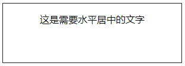
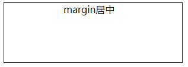
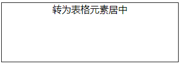
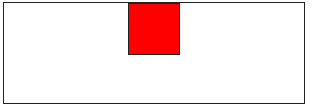

# CSS布局之元素水平居中

本文将依次介绍在不同条件下实现**水平居中**的多种方法及简单原理

 **Tip：**下文中说的适用场景只是举了几个简单的例子方便读者理解。实际应用场景太复杂，生搬硬套容易出错。最重要的是掌握各种方法能够实现居中的原理。只要掌握了原理，那么不管问题怎么变都可以根据自己的理解选择合适的方法。

## 一、使用 text-align: center 

### 1.原理

文本居中对齐**text-align: center**，可以适用于**文本及图片**的对齐 

### 2.实现步骤

**（1）直接在父元素中设置text-align: center;**

### 3.适用场景

**（1）适用于块级元素内部的行内元素水平居中**
**（2）适用于块级元素内图片的水平居中**
**（3）此方法对inline、inline-block、inline-table和inline-flex元素水平居中都有效**

### 4.完整代码

**（1）子元素为行内元素，直接使用text-align: center;进行水平居中**

```html
<!DOCTYPE html>
<html>
<head>
    <meta charset="UTF-8">
    <title>这是需要水平居中的文字</title>
    <style>
        .box {
            width: 300px;
            height: 100px;
            text-align: center;
            /*设置子元素内的行内元素水平居中*/
            border: 1px solid #222222;
        }
    </style>
</head>
<body>
    <div class="box">
        <p>这是需要水平居中的文字</p>
    </div>
</body>
</html>
```



**（2）如果子元素是一个块级元素，我们可以先将其由块级元素改变为行内块元素，再通过设置行内块元素居中以达到水平居中。**

```html
<!DOCTYPE html>
<html>
<head>
    <meta charset="UTF-8">
    <title>这是需要水平居中的内容</title>
    <style>
       .box {
            width: 300px;
            height: 100px;
            text-align: center;
            /*设置子元素内的行内元素水平居中*/
            border: 1px solid #222222;
        }
        .child {
            display: inline-block;
            /*将块级元素转为行内元素实现居中。但不建议，因为转换了元素类型，可能会破坏布局*/
        }
    </style>
</head>
<body>
    <div class="box">
        <div class="child">这是需要居中的内容</div>
    </div>
</body>
</html>
```


## 二、使用 margin

### 1.原理

利用**margin**属性的**auto**值，设置左右左右外边距为**自动**实现居中（只能设置水平居中，对垂直居中无效）

### 2.实现步骤

**（1）子元素必须要有宽度**
**（2）设置子元素的margin: 0 auto实现水平居中**

### 3.适用场景

**（1）有宽度的子元素**

### 4.完整代码

**（1）有确定宽度使用margin居中**

```html
<!DOCTYPE html>
<html>
<head>
    <meta charset="UTF-8">
    <title>margin居中</title>
    <style>
        .box {
            width: 300px;
            height: 100px;
            border: 1px solid #222222;
        }
        .child {
            width: 100px;/*设置子元素宽度*/
            margin: 0 auto;/*设置左右外边距自动实现水平居中*/
        }
    </style>
</head>
<body>
    <div class="box">
        <div class="child">margin居中</div>
    </div>
</body>
</html>
```




（2）若不知道子元素宽度可用**width:fit-content**配合**margin**居中

```html
<!DOCTYPE html>
<html>
<head>
    <meta charset="UTF-8">
    <title>fit-content居中</title>
    <style>
        .box {
            width: 300px;
            height: 100px;
            border: 1px solid #222222;
        }
        .child {
            width: fit-content;
            /*类似于包裹内容，宽度为内容宽度*/
            margin: 0 auto;
        }
    </style>
</head>
<body>
    <div class="box">
        <div class="child">fit-content</div>
    </div>
</body>
</html>
```


**（3）用display:table；将子元素设为table元素，宽度为内容宽，再使用margin居中**

```html
<!DOCTYPE html>
<html>
<head>
    <meta charset="UTF-8">
    <title>转为表格元素居中</title>
    <style>
        .box {
            width: 300px;
            height: 100px;
            border: 1px solid #222222;
        }
        .child {
            display: table;
            /*将元素转换为table类型*/
            margin: 0 auto;
            /*设置上下外边距为0，左右外边距自动*/
        }
    </style>
</head>
<body>
    <div class="box">
        <div class="child">转为表格元素居中</div>
    </div>
</body>
</html>
```



## 三、使用相对定位relative和绝对定位absolute

### 1.原理

使用定位将元素移动到所需要的位置上，将元素**定位到水平居中的位置**就实现了居中
Tip：注意元素定位是以元素的**某个边**或者**某个角**作为参考，而不是以元素的中心点为参考
例：单个使用，是以**边框**为参考，两个组合使用是以**角**为参考点
（1）**top：**以元素上边框为参考，top：50px；就是元素上边框距离父元素上边框50px
（2）**right：**以元素右边框为参考，right：50px；就是元素右边框距离父元素右边框50px
（3）**left**和**top**组合使用：以元素的左上角的点为参考，top：50px；left：50px；表示元素左上角的点距离父元素上边框50px，距离父元素左边框50px；
（4）**right**和**bottom**组合使用：以元素的右下角的点为参考，bottom：50px；right：50px；表示元素右下角的点距离父元素下边框50px，距离父元素右边框50px；
（5）其他各种组合同理，两个对立方向的属性不能同时组合使用。例如top和bottom同时使用以top为准，bottom会失效。left和right；同时使用的话会以left为准right会失效。
（6）所以定位50%是，子元素边框移动到50%的位置，还需要移动回来子元素一半的宽度，达到真正的居中


### 2.实现步骤

**（1）先将父元素设置为相对定位relative**
**（2）将子元素设置为绝对定位absolute（子绝父相）**
**（3）向右移动子元素，移动距离为父容器宽度的一半（50%）**
**（4）通过向左移动子元素的一半宽度以达到水平居中。（通过transform或margin实现）**

### 3.适用场景

**（1）未知宽度的子元素（使用transform）**
**（2）已知宽度的子元素（使用margin）**

### 4.完整代码

（1）使用transform属性：不定宽，不需要有确定的宽度也可实现居中

```html
<!DOCTYPE html>
<html>
<head>
    <meta charset="UTF-8">
    <title>transform居中</title>
    <style>
        .box {
            width: 300px;
            height: 100px;
            position: relative;
            border: 1px solid #222222;
        }
        .child {
            position: absolute;
            left: 50%;
            transform: translateX(-50%);
        }
    </style>
</head>
<body>
    <div class="box">
        <div class="child">transform居中</div>
    </div>
</body>
</html>
```


**（2）margin属性：子元素必须设置确定的宽度，且margin值不能用百分制会导致失效，要使用px**

```html
<!DOCTYPE html>
<html>
<head>
    <meta charset="UTF-8">
    <title>margin</title>
    <style>
        .box {
            width: 300px;
            height: 200px;
            position: relative;
            border: 1px solid #222222;
        }
        .child {
            width: 100px;
            height: 100px;
            position: absolute;
            left: 50%;
            margin-left: -50px;
            background: red;
        }
    </style>
</head>
<body>
    <div class="box">
        <div class="child"></div>
    </div>
</body>
</html>
```


## 四、使用弹性盒子flex布局（通用方法）

### 方法一： justify-content属性

### 1.原理

利用布局神器弹性盒子的**justify-content属性**进行主轴方向布局。弹性盒子默认主轴是**左右方向**，侧轴是**上下方向**，设置主轴左右方向居中。即可达到使子元素左右居中的效果。

### 2.实现步骤

**（1）父元素开启弹性盒子display:flex;**
**（2）父元素设置 justify-content:center;（主方向居中对齐）**

### 3.适用场景

**（1）未知宽度的元素水平居中**
**（2）已知宽度的元素水平居中**
**（3）浮动元素的水平居中**
**（4）可适用于多个子元素同时水平居中**

### 4.完整代码

（1）通过justify-content属性实现居中

```html
<!DOCTYPE html>
<html>
<head>
    <meta charset="UTF-8">
    <title>justify-content</title>
    <style>
        .box {
            width: 300px;
            height: 100px;
            border: 1px solid #222222;
            display: flex;/*开启弹性盒子*/
            justify-content: center;/*设置主轴方向居中，对子元素生效*/
        }
        .child {
            width: 50px;
            height: 50px;
            background: red;
            border: 1px solid #222222;
        }
    </style>
</head>
<body>
    <div class="box">
        <div class="child"></div>
        <div class="child"></div>
    </div>
</body>
</html>
```


### 方法二： align-item属性

### 1.原理

利用布局神器弹性盒子的**flex-direction:column**更改主轴方向为上下方向。弹性盒子默认主轴是**左右方向**，侧轴是**上下方向**。更改后使用**align-items属性**设置子元素在侧轴方向居中，即可达到使子元素左右居中的效果。如果想对子元素单独设置，可在子元素上使用align-self属性，可以覆盖掉父元素的align-items属性。

### 2.实现步骤

**（1）父元素开启弹性盒子display:flex;**
**（2）父元素使用flex-direction:column更改主轴方向为纵向**
**（3）父元素使用align-items属性设置子元素在侧轴方向居中**

### 3.适用场景

**（1）未知宽度的元素水平居中**
**（2）已知宽度的元素水平居中**
**（3）浮动元素的水平居中**

### 4.完整代码

**align-self属性：**对子元素使用（解决有多个子元素，用flex布局实现其中单个子元素的居中的问题）

```html
<!DOCTYPE html>
<html>
<head>
    <meta charset="UTF-8">
    <title>align-self</title>
    <style>
        .box {
            width: 300px;
            height: 100px;
            border: 1px solid #222222;
            display: flex;
            flex-direction:column;/*设置主轴为纵向排列，此时侧轴为横向排列*/
            align-items:center;/*设置子元素在侧轴方向上居中*/
        }
        .child {
            width: 50px;
            height: 50px;
            background: red;
            border: 1px solid #222222;
            /*align-self:center;可以单独设置某个子元素的对齐方式*/
            /*设置本身元素在侧轴方向上居中*/
        }
    </style>
</head>
<body>
    <div class="box">
        <div class="child"></div>
    </div>
</body>
</html>
```



### 方法三： margin属性

### 1.原理

在开启弹性盒子的时候也可以使用**margin属性**的**auto值**来居中，此时不需要有具体宽度

### 2.实现步骤

**（1）父元素开启弹性盒子display:flex;**
**（2）子元素使用margin:0 auto;属性设置自身水平居中**

### 3.适用场景

**（1）未知宽度的元素水平居中**
**（2）已知宽度的元素水平居中**
**（3）浮动元素的水平居中**

### 4.完整代码

```html
<!DOCTYPE html>
<html>
<head>
    <meta charset="UTF-8">
    <title>flex+margin</title>
    <style>
        .box {
            width: 300px;
            height: 100px;
            border: 1px solid #222222;
            display: flex;/*开启弹性盒子*/
        }
        .child {
            width: 50px;
            height: 50px;
            background: red;
            border: 1px solid #222222;
            margin:0 auto;/*子元素利用maigin的auto值设置居中*/
        }
    </style>
</head>
<body>
    <div class="box">
        <div class="child"></div>
    </div>
</body>
</html>
```

