### state庞大怎么分块

```
可以按功能（控制显隐）、按类型（数据、按钮）等去把state分成几个小的state，最后集合在一起导出
```

### vue和react的区别

```
两种都是做组件化的，整体功能类似
react是函数的思想，数据不可变，状态和逻辑通过参数传入，单向的数据流；
大量使用es6的语法，通过js操作接近原生。
vue是响应式的思想，数据可变，支持双向绑定，通过对每个属性监听，属性变化时，响应式的更新对应的数据MVVM模式数据的双向绑定
但是当vue的state特别多时，监听也会特别多，导致卡顿。一般大型项目，状态特别多时用react；
vue是把html，css，js等组合到一起，

1.数据是不是可变的
2.通过js操作一切还是各自的处理方式web
3.类式的组件写法还是声明式的写法
4.什么功能内置，什么交给社区去做
```

### vue双向绑定原理

```
vue.js 则是采用数据劫持结合发布者-订阅者模式的方式，通过Object.defineProperty()来劫持各个属性的setter，getter，在数据变动时发布消息给订阅者，触发相应的监听回调。
```

### vuex的原理，说说在项目中怎么用

```

```

### vue父子组建，同级组建的传值

```

```

### vue在data中添加修改数据，怎么实现页面的刷新

```

```

### node.js的适用场景

```

```

### 前端路由是直接找到与地址匹配的一个而组建或对象，并将其渲染出来，改变浏览器地址而不向服务器发出请求有两种方式

```
1.hash在地址中加入#以欺骗浏览器，地址的改变是由于正在进行页面内导航
2.使用H5的window.history功能，使用URL的Hash来模拟一个完整的URL
```

### 懒加载是什么

```txt
懒加载也就是延迟加载
当访问一个页面的时候，先把img元素或是其他元素的背景图片路径替换成一张大小为1*1px图片的路径（这样就只需请求一次，俗称占位图），只有当图片出现在浏览器的可视区域内时，才设置图片正真的路径，让图片显示出来。这就是图片懒加载。

懒加载优势:
(1) 节省网络资源 – 一次性加载所有资源很慢
(2) 对用户体验 – 节省流量, 使用友好
(3) 对服务器而言 – 减轻负载压力

用原生js实现懒加载
 1、 懒加载的概念：在图片非常多的应用场景，为了提高也没面加载速度，改善用户体验，我们对未出现在视野范围内的图片先不进行加载，等到出现在视野范围才去加载。
    2、为什么要懒加载：懒加载（ LazyLoad ）是前端优化的一种有效方式，极大的提升用于体验，图片一直是页面加载的流量大户，现在一张图片几兆已经是很正常的事，远远大于代码的大小。倘若一次ajax请求过来10张图片的地址，而且一次性把10张图片都加载出来，肯定是不合理的，后果是：
            1）、会显示的很慢，多加载1秒都会引起用户的流失，这对靠流量的网站来说绝对是噩梦；
            2）、用户如果只是随便看看，没想全部看，这无疑是浪费了用户很多流量。
    3、懒加载的实现原理：
        原理很简单，先把img的src指向空或者一个小图片，图片真实的地址存储在img的一个自定义的属性里，比如data-xx = “ 图片的真实地址 ”。添加滚动条事件，当页面滚动直至此图片出现在可视区域时，用js取到该图片的data-xx 的值赋给 src。
```


### 前端状态管理

```txt
前端状态管理实际上解决的就是组件通讯以及状态集中管理和分发的问题
将浏览器与web服务器的多次交互当作一个整体来处理，将多次交互所涉及的数据状态保存下来
状态指的是数据
管理指的是多次交互时对数据的修改
管理方式1：将状态保存在浏览器，需要使用cookie技术
管理方式2：将状态保存在服务器，需要使用session技术
```

### 浏览器缓存

```txt
访问网页的时候，需要从服务器下载一些页面渲染所需的资源，比如html文档，css，js，图片等，有的资源是很少变动的，比如代表公司的logo图。如果把这些资源保存下来，下次请求的时候，直接从本地的缓存里加载，不用再次从网页的服务器请求数据，减少了服务器的负载，缩短了页面加载时间
强缓存：强制使用缓存，不从服务器请求数据
协商缓存：判断本地资源是否过期，如果过期则请求最新数据
```

### ajax如何处理后台数据交互

```
它依赖的是现有的CSS/HTML/Javascript，而其中最核心的依赖是浏览器提供的XMLHttpRequest对象。这个对象为向服务器发送请求和解析服务器响应提供了流畅的接口，使得浏览器可以发出HTTP请求与接收HTTP响应，实现在页面不刷新的情况下和服务端进行数据交互。
首先，XMLHttpRequest构造函数通过new的方式构造一个XHR对象，并将这个对象赋值给xhr（可取任意名字）
然后，调用XMLHttpRequest对象的方法open与send
调用send方法之后请求被发往服务器，由于这次请求是同步的，JS代码会在xhr.send()这个步骤暂停掉，一直等到服务器根据请求生成响应（Response），传回给XHR对象，再继续执行。
最后，在收到响应后相应数据会填充到XHR对象的属性。
```

### 没有UI的话，你如何处理素材

```

```

### 封装过哪些插件，组建。做过哪些demo

```

```

### 你做的页面在哪些浏览器测试过，这些浏览器的内核分别是什么

```

```

### 简述下移动端事件

```

```

### 简述下移动端300ms延迟

```

```

### git怎么用

```

```

### 线上测试怎么做

```

```

### 订单页面怎么根据不同的用户拿到不同的数据

```

```

### 说说token，用在哪

```

```

### window.download和load的区别

```

```

### 你对前端页面的性能优化有什么好的解决方案

```
1、CSS放在页面最上部（head标签中），JS 文件放在页面最下面
    浏览器会在下载完成全部 CSS 之后 才对整个页面进行渲染， 因此最好的做法是将CSS 放在页面最上面（是将CSS放在head中），让浏览器尽快下载CSS。
    js 文件则相反，浏览器在加载 js 后，立即执行，有可能会阻塞整个页面，造成页面显示缓慢，因此 js 最好放在页面最下面。但是，如果页面解析时就需要用到 js文件，这时放到底部就不合适了。

2、尽可能少的 设置 全局变量。

3、尽量减少DOM 操作

4、不要再标签中设置样式，最好 外部引用 CSS文件。

5、减少http 请求，合理设置 HTTP 缓存；（最有效的办法）
    http协议是无状态的应用层协议，意味着每次 http 请求都需要建立通信链路、进行数据传输，而在服务器端，每个 http 都需要启动独立的线程去处理。这些通信和服务的开销都很昂贵，减少 http 请求的数目可有效提高访问性能。
        减少http 的主要手段是 合并 CSS 、 合并 js 、 合并图片（多张图片合并成一张）。
        设置HTTP 缓存：  缓存的力量是强大的，恰当的缓存设置可以大大的减少 HTTP请求。假设某网站首页，当浏览器没有缓存的时候访问一共会发出 78个请求，共 600多 K数据，而当第二次访问即浏览器已缓存之后访问则仅有 10个请求，共 20多 K数据。 
        怎样才能合理设置？ 原则很简单，能缓存越多越好，能缓存越久越好。
         如果可以的话，尽可能的将外部的脚本、样式进行合并，多个合为一个。另外， CSS、 Javascript、Image 都可以用相应的工具进行压缩，压缩后往往能省下不少空间。

6、使用浏览器缓存
    对一个网站而言，CSS、js、logo、图标这些静态资源文件更新的频率都比较低，而这些文件几乎是每次 http 请求都需要的，如果将这些文件缓存在浏览器中，可以极好的改善性能。  通过设置 http 头中 的 cache-control 和 expires 的属性，可设定浏览器缓存，缓存时间可以是数天，甚至是几个月。

7、如果遇到大的文件，可以将文件放置在一个定时器中 ，利用异步操作，等其他的文件加载完成后，再加载 定时器中的文件。

8、CSS Sprites
    合并 CSS 图片

9、 图片的懒加载
   这条策略实际上并不一定能减少 HTTP 请求数，但是却能在某些条件下，或者页面刚加载时 减少 HTTP 请求数。对于图片而言，在页面刚加载的时候 ，可以只加载第一屏，当用户继续往后滚屏的时候，才加载后续的图片。

10、减少 cookie 传输 ，尽量使用 localStorage 存储 本地数据
    一方面，cookie 包含在每次请求和响应中，太大的 cookie 会严重影响数据传输，因此哪些数据需要写入cookie 需要慎重考虑，尽量减少 cookie 中传输的数据量。

11、将 Image 进行压缩。
```

### 你解决过哪些浏览器兼容性问题

```
1、不同浏览器的标签，默认的 margin 和 padding 不同，
    解决方案：在 CSS 中 添加 *{ margin: 0 ; padding : 0 }
    几乎所有的 CSS 文件开头都会用 通配符 * 来设置各个标签的 margin padding 为 0
2、各种特殊样式的兼容
    比如 透明度、 圆角 、阴影 等。
    特殊样式每个浏览器的代码 区别很大，所以，只能现查资料，通过给不同浏览器写不同的代码或者 前缀 来解决。
    比如 透明度 opacity , IE 一下浏览器不能使用 opacity , 解决方法是：
    opacity : 0.5;  //  取值范围是 0 --- 1
    filter : alpha ( opacity = 50 );  取值范围是 0 --- 100


3、获取窗口大小或可视区域大小等方法不同

4、IE和 其他浏览器中的兼容
    1）
HTML5Shiv 主要解决 HTML5提出的新元素不被IE6-8识别
IE9 以下浏览器 对 html5 新增标签不识别的问题。可以引入 一个外部 js 兼容文件，我的笔记上 记着

<!--[if lt IE 9]> <script type="text/javascript" src="https://cdn.bootcss.com/html5shiv/3.7.3/html5shiv.min.js"></script> <![endif]-->
   
     2）事件对象 
         DOM 0 级事件中，IE的event事件对象是window的一个属性，而其他浏览器中，事件对象作为事件处理函数的参数。
    兼容写法： var evt = event || window.event;
        
    3） 事件对象的事件源
        浏览器中 event.target是触发的事件源，但IE中没有 target属性，但他有srcElement 属性，和 target 一样
    兼容写法：var target = evt . target || evt . srcElement ;
    
    4）添加 DOM 2级事件时。
        浏览器通过 addEventListener( ) 添加监听事件，通过 removeEventListener( ) 方法 移除 监听的事件。
        IE 中的添加 DOM 2级事件，通过 attachEvent( ) 添加监听事件，通过 detachEvent( ) 移除 监听的事件。

    5）阻止冒泡行为
        浏览器中阻止冒泡行为 是 通过 事件对象 event . stopPropagation( ) 方法阻止冒泡；
        IE 中阻止冒泡的方法是 设置 事件对象的cancelBubble 属性为 ture 
        window . event .cancelBubble = true
    
    6）阻止默认行为
        浏览器中阻止默认行为是 事件对象的 preventDefault( )方法，
        event . preventDefault ( );
        IE中组织默认行为是 设置事件对象的returnValue 属性为 false
        window . event . returnValue = false;
        
       两者都兼容的， 还有一种方法，return false, 可以同时阻止冒泡行为和阻止默认行为
    
    7）DOM 操作时，IE和其他浏览器获取 某元素的第一个子元素 或 最后一个子元素写法不同

5、polyfill 

6、HTML5Shiv 主要解决 HTML5提出的新元素不被IE6-8识别
```

### 如果使页面的动画效果更流畅

```

```

### http 2.0对于http 1.x有哪些优点？

```
优点（以下摘自HTTP/2.0 相比1.0有哪些重大改进？）：
	* 
多路复用：多路复用允许同时通过单一的 HTTP/2 连接发起多重的请求-响应消息。由于http 1.x的时代中，浏览器向同一域名下发送的http请求数量是受限的，当超出数量限制时，请求会被阻塞，大大降低了用户体验。而HTTP/2 的多路复用允许同时通过单一的 HTTP/2 连接发起多重的请求-响应消息。
	* 
二进制分帧：HTTP/2在应用层和传输层之间追加了一个二进制分帧层，最终使得多个数据流共用一个连接，更加高效的使用tcp连接。从而使得服务器的连接压力减轻，降低了内存的消耗，增大了网络的吞吐量。
	* 
首部压缩：HTTP/2引入了HPACK算法对头部进行压缩，大大减小了数据发送的字节数。
```

### 说一说你知道的HTTP状态码

```
以前遇到面试者说 HTTP状态码不应该是前端开发关心的事情。但我总觉得一个前端工程师对于http状态码的了解程度代表了他曾经踩过了多少雷，一个深入了解http状态码的工程师可以快速定位问题。
关于HTTP状态码应该有下面的基本认识：
	* 
1xx ：1开头的状态码表示临时的响应
	* 
2xx ：请求成功
	* 
3xx ：请求被重定向
	* 
4xx ：请求错误，表明客户端发送的请求有问题
	* 
5xx ：服务器错误，表明服务端在处理请求时发生了错误


知道上面的规律，再看到错误的时候就大概知道问题是后端的锅还是前端的锅了。
再说几个常用的http状态码（如果有兴趣了解详细的话还是自己去找吧，网上很多）：
	* 
301 ： Moved Permanently 客户端请求的文档在其他地方，新的URL在location头中给出
	* 
304 ： Not Modified 客户端有缓存的文档并发出了一个条件性的请求（一般是提供If-Modified-Since头表示客户端只想到指定日期后再更新文档）。服务器告诉客户，原来缓存的文档还可以继续使用。
	* 
400 ： Bad Request 请求出现语法错误
	* 
401 ： Unauthorized 访问被拒绝，客户端试图胃镜授权访问受密码保护的页面
	* 
403 ： Forbidden 资源不可用。服务器理解客户的请求，但拒绝处理它。通常由于服务器文件或目录的权限设置导致。
	* 
404 ： Not Found 无法找到指定位置的资源。
	* 
405 ： Method Not Allowed 请求方法（GET、POST、PUT等）对指定的资源不适用，用来访问本资源的HTTP方法不被允许。
	* 
500 ： Internal Server Error 服务器遇到了意料之外的情况，不能完成客户端的请求。
	* 
502 ： Bad Gateway 服务器作为网管或者代理时收到了无效的响应。
	* 
503 ： Service Unavailable 服务不可用，服务器由于维护或者负载过中未能应答。
	* 
504 ： Gateway Timeout 网关超时， 作为代理或网关的服务器不能及时的应答。


```

### 说说TCP传输的三次握手四次挥手策略

```
为了准确无误地把数据送达目标处，TCP协议采用了三次握手策略。用TCP协议把数据包送出去后，TCP不会对传送 后的情况置之不理，它一定会向对方确认是否成功送达。握手过程中使用了TCP的标志：SYN和ACK。
发送端首先发送一个带SYN标志的数据包给对方。接收端收到后，回传一个带有SYN/ACK标志的数据包以示传达确认信息。 最后，发送端再回传一个带ACK标志的数据包，代表“握手”结束。 若在握手过程中某个阶段莫名中断，TCP协议会再次以相同的顺序发送相同的数据包。
断开一个TCP连接则需要“四次握手”：
	* 
第一次挥手：主动关闭方发送一个FIN，用来关闭主动方到被动关闭方的数据传送，也就是主动关闭方告诉被动关闭方：我已经不 会再给你发数据了(当然，在fin包之前发送出去的数据，如果没有收到对应的ack确认报文，主动关闭方依然会重发这些数据)，但是，此时主动关闭方还可 以接受数据。
	* 
第二次挥手：被动关闭方收到FIN包后，发送一个ACK给对方，确认序号为收到序号+1（与SYN相同，一个FIN占用一个序号）。
	* 
第三次挥手：被动关闭方发送一个FIN，用来关闭被动关闭方到主动关闭方的数据传送，也就是告诉主动关闭方，我的数据也发送完了，不会再给你发数据了。
	* 
第四次挥手：主动关闭方收到FIN后，发送一个ACK给被动关闭方，确认序号为收到序号+1，至此，完成四次挥手。


```

### TCP和UDP的区别

```
TCP（Transmission Control Protocol，传输控制协议）是基于连接的协议，也就是说，在正式收发数据前，必须和对方建立可靠的连接。一个TCP连接必须要经过三次“对话”才能建立起来
UDP（User Data Protocol，用户数据报协议）是与TCP相对应的协议。它是面向非连接的协议，它不与对方建立连接，而是直接就把数据包发送过去！ UDP适用于一次只传送少量数据、对可靠性要求不高的应用环境。
```

### 说说你对作用域链的理解 

```
作用域链的作用是保证执行环境里有权访问的变量和函数是有序的，作用域链的变量只能向上访问，变量访问到window对象即被终止，作用域链向下访问变量是不被允许的。
```

### 渐进增强和优雅降级   

```
渐进增强 ：针对低版本浏览器进行构建页面，保证最基本的功能，然后再针对高级浏览器进行效果、交互等改进和追加功能达到更好的用户体验。
优雅降级 ：一开始就构建完整的功能，然后再针对低版本浏览器进行兼容。
```

### 常见web安全及防护原理  

```
sql注入原理
就是通过把SQL命令插入到Web表单递交或输入域名或页面请求的查询字符串，最终达到欺骗服务器执行恶意的SQL命令。
总的来说有以下几点：


1.永远不要信任用户的输入，要对用户的输入进行校验，可以通过正则表达式，或限制长度，对单引号和双"-"进行转换等。

2.永远不要使用动态拼装SQL，可以使用参数化的SQL或者直接使用存储过程进行数据查询存取。

3.永远不要使用管理员权限的数据库连接，为每个应用使用单独的权限有限的数据库连接。

4.不要把机密信息明文存放，请加密或者hash掉密码和敏感的信息。
XSS原理及防范
Xss(cross-site scripting)攻击指的是攻击者往Web页面里插入恶意 html标签或者javascript代码。比如：攻击者在论坛中放一个
看似安全的链接，骗取用户点击后，窃取cookie中的用户私密信息；或者攻击者在论坛中加一个恶意表单，
当用户提交表单的时候，却把信息传送到攻击者的服务器中，而不是用户原本以为的信任站点。
XSS防范方法
首先代码里对用户输入的地方和变量都需要仔细检查长度和对”<”,”>”,”;”,”’”等字符做过滤；其次任何内容写到页面之前都必须加以encode，避免不小心把html tag 弄出来。这一个层面做好，至少可以堵住超过一半的XSS 攻击。
首先，避免直接在cookie 中泄露用户隐私，例如email、密码等等。
其次，通过使cookie 和系统ip 绑定来降低cookie 泄露后的危险。这样攻击者得到的cookie 没有实际价值，不可能拿来重放。
如果网站不需要再浏览器端对cookie 进行操作，可以在Set-Cookie 末尾加上HttpOnly 来防止javascript 代码直接获取cookie 。
尽量采用POST 而非GET 提交表单
XSS与CSRF有什么区别吗？
XSS是获取信息，不需要提前知道其他用户页面的代码和数据包。CSRF是代替用户完成指定的动作，需要知道其他用户页面的代码和数据包。
要完成一次CSRF攻击，受害者必须依次完成两个步骤：


登录受信任网站A，并在本地生成Cookie。

在不登出A的情况下，访问危险网站B。
CSRF的防御
	* 
服务端的CSRF方式方法很多样，但总的思想都是一致的，就是在客户端页面增加伪随机数。
	* 
通过验证码的方法


```

### Web Worker 和webSocket   

```
worker主线程:


1.通过 worker = new Worker( url ) 加载一个JS文件来创建一个worker，同时返回一个worker实例。

2.通过worker.postMessage( data ) 方法来向worker发送数据。

3.绑定worker.onmessage方法来接收worker发送过来的数据。

4.可以使用 worker.terminate() 来终止一个worker的执行。
WebSocket是Web应用程序的传输协议，它提供了双向的，按序到达的数据流。他是一个HTML5协议，WebSocket的连接是持久的，他通过在客户端和服务器之间保持双工连接，服务器的更新可以被及时推送给客户端，而不需要客户端以一定时间间隔去轮询。

```

### HTTP和HTTPS 

```
HTTP协议通常承载于TCP协议之上，在HTTP和TCP之间添加一个安全协议层（SSL或TSL），这个时候，就成了我们常说的HTTPS。
默认HTTP的端口号为80，HTTPS的端口号为443。

```

### 为什么HTTPS安全 

```
因为网络请求需要中间有很多的服务器路由器的转发。中间的节点都可能篡改信息，而如果使用HTTPS，密钥在你和终点站才有。https之所以比http安全，是因为他利用ssl/tls协议传输。它包含证书，卸载，流量转发，负载均衡，页面适配，浏览器适配，refer传递等。保障了传输过程的安全性

```

### 对前端模块化的认识   

```
AMD 是 RequireJS 在推广过程中对模块定义的规范化产出。
CMD 是 SeaJS 在推广过程中对模块定义的规范化产出。
AMD 是提前执行，CMD 是延迟执行。
AMD推荐的风格通过返回一个对象做为模块对象，CommonJS的风格通过对module.exports或exports的属性赋值来达到暴露模块对象的目的。
CMD模块方式


define(function(require, exports, module) {

// 模块代码

});

```

### 谈谈性能优化问题  

```
代码层面：避免使用css表达式，避免使用高级选择器，通配选择器。
缓存利用：缓存Ajax，使用CDN，使用外部js和css文件以便缓存，添加Expires头，服务端配置Etag，减少DNS查找等
请求数量：合并样式和脚本，使用css图片精灵，初始首屏之外的图片资源按需加载，静态资源延迟加载。
请求带宽：压缩文件，开启GZIP，
代码层面的优化
	* 
用hash-table来优化查找
	* 
少用全局变量
	* 
用innerHTML代替DOM操作，减少DOM操作次数，优化javascript性能
	* 
用setTimeout来避免页面失去响应
	* 
缓存DOM节点查找的结果
	* 
避免使用CSS Expression
	* 
避免全局查询
	* 
避免使用with(with会创建自己的作用域，会增加作用域链长度)
	* 
多个变量声明合并
	* 
避免图片和iFrame等的空Src。空Src会重新加载当前页面，影响速度和效率
	* 
尽量避免写在HTML标签中写Style属性

移动端性能优化
	* 
尽量使用css3动画，开启硬件加速。
	* 
适当使用touch事件代替click事件。
	* 
避免使用css3渐变阴影效果。
	* 
可以用transform: translateZ(0)来开启硬件加速。
	* 
不滥用Float。Float在渲染时计算量比较大，尽量减少使用
	* 
不滥用Web字体。Web字体需要下载，解析，重绘当前页面，尽量减少使用。
	* 
合理使用requestAnimationFrame动画代替setTimeout
	* 
CSS中的属性（CSS3 transitions、CSS3 3D transforms、Opacity、Canvas、WebGL、Video）会触发GPU渲染，请合理使用。过渡使用会引发手机过耗电增加
	* 
PC端的在移动端同样适用


相关阅读：如何做到一秒渲染一个移动页面
https://github.com/cssmagic/blog/issues/20
```

### 什么是Etag？   

```
当发送一个服务器请求时，浏览器首先会进行缓存过期判断。浏览器根据缓存过期时间判断缓存文件是否过期。
情景一：若没有过期，则不向服务器发送请求，直接使用缓存中的结果，此时我们在浏览器控制台中可以看到 200 OK(from cache) ，此时的情况就是完全使用缓存，浏览器和服务器没有任何交互的。
情景二：若已过期，则向服务器发送请求，此时请求中会带上①中设置的文件修改时间，和Etag
然后，进行资源更新判断。服务器根据浏览器传过来的文件修改时间，判断自浏览器上一次请求之后，文件是不是没有被修改过；根据Etag，判断文件内容自上一次请求之后，有没有发生变化
情形一：若两种判断的结论都是文件没有被修改过，则服务器就不给浏览器发index.html的内容了，直接告诉它，文件没有被修改过，你用你那边的缓存吧—— 304 Not Modified，此时浏览器就会从本地缓存中获取index.html的内容。此时的情况叫协议缓存，浏览器和服务器之间有一次请求交互。
情形二：若修改时间和文件内容判断有任意一个没有通过，则服务器会受理此次请求，之后的操作同①
① 只有get请求会被缓存，post请求不会
```

### Expires和Cache-Control

```
Expires要求客户端和服务端的时钟严格同步。HTTP1.1引入Cache-Control来克服Expires头的限制。如果max-age和Expires同时出现，则max-age有更高的优先级。


Cache-Control: no-cache, private, max-age=0

ETag: abcde

Expires: Thu, 15 Apr 2014 20:00:00 GMT

Pragma: private

Last-Modified: $now // RFC1123 formatETag应用:
Etag由服务器端生成，客户端通过If-Match或者说If-None-Match这个条件判断请求来验证资源是否修改。常见的是使用If-None-Match。请求一个文件的流程可能如下：
====第一次请求===


1.客户端发起 HTTP GET 请求一个文件；

2.服务器处理请求，返回文件内容和一堆Header，当然包括Etag(例如"2e681a-6-5d044840")(假设服务器支持Etag生成和已经开启了Etag).状态码200
====第二次请求===


客户端发起 HTTP GET 请求一个文件，注意这个时候客户端同时发送一个If-None-Match头，这个头的内容就是第一次请求时服务器返回的Etag：2e681a-6-5d0448402.服务器判断发送过来的Etag和计算出来的Etag匹配，因此If-None-Match为False，不返回200，返回304，客户端继续使用本地缓存；流程很简单，问题是，如果服务器又设置了Cache-Control:max-age和Expires呢，怎么办
答案是同时使用，也就是说在完全匹配If-Modified-Since和If-None-Match即检查完修改时间和Etag之后，
服务器才能返回304.(不要陷入到底使用谁的问题怪圈)
为什么使用Etag请求头?
Etag 主要为了解决 Last-Modified 无法解决的一些问题。
```

### 栈和队列的区别?   

```
栈的插入和删除操作都是在一端进行的，而队列的操作却是在两端进行的。

队列先进先出，栈先进后出。

栈只允许在表尾一端进行插入和删除，而队列只允许在表尾一端进行插入，在表头一端进行删除
栈区（stack）— 由编译器自动分配释放 ，存放函数的参数值，局部变量的值等。

堆区（heap） — 一般由程序员分配释放， 若程序员不释放，程序结束时可能由OS回收。

堆（数据结构）：堆可以被看成是一棵树，如：堆排序；

栈（数据结构）：一种先进后出的数据结构。
```

### 快速 排序的思想并实现一个快排？  

```
“快速排序”的思想很简单，整个排序过程只需要三步：
　　（1）在数据集之中，找一个基准点
　　（2）建立两个数组，分别存储左边和右边的数组
　　（3）利用递归进行下次比较


<script type="text/javascript">

function quickSort(arr){
if(arr.length<=1){
return arr;//如果数组只有一个数，就直接返回；
}

var num = Math.floor(arr.length/2);//找到中间数的索引值，如果是浮点数，则向下取整

var numValue = arr.splice(num,1);//找到中间数的值
var left = [];
var right = [];

for(var i=0;i<arr.length;i++){
if(arr[i]<numValue){
left.push(arr[i]);//基准点的左边的数传到左边数组
}
else{
right.push(arr[i]);//基准点的右边的数传到右边数组
}
}

return quickSort(left).concat([numValue],quickSort(right));//递归不断重复比较
}

alert(quickSort([32,45,37,16,2,87]));//弹出“2,16,32,37,45,87”

</script>

```

### 你觉得jQuery或zepto源码有哪些写的好的地方   

```
jquery源码封装在一个匿名函数的自执行环境中，有助于防止变量的全局污染，然后通过传入window对象参数，可以使window对象作为局部变量使用，好处是当jquery中访问window对象的时候，就不用将作用域链退回到顶层作用域了，从而可以更快的访问window对象。同样，传入undefined参数，可以缩短查找undefined时的作用域链。


(function( window, undefined ) {

//用一个函数域包起来，就是所谓的沙箱

//在这里边var定义的变量，属于这个函数域内的局部变量，避免污染全局

//把当前沙箱需要的外部变量通过函数参数引入进来

//只要保证参数对内提供的接口的一致性，你还可以随意替换传进来的这个参数

window.jQuery = window.$ = jQuery;

})( window );
jquery将一些原型属性和方法封装在了jquery.prototype中，为了缩短名称，又赋值给了jquery.fn，这是很形象的写法。
有一些数组或对象的方法经常能使用到，jQuery将其保存为局部变量以提高访问速度。
jquery实现的链式调用可以节约代码，所返回的都是同一个对象，可以提高代码效率。

```

### 关于Http 2.0 你知道多少？

```
HTTP/2引入了“服务端推（server push）”的概念，它允许服务端在客户端需要数据之前就主动地将数据发送到客户端缓存中，从而提高性能。
HTTP/2提供更多的加密支持
HTTP/2使用多路技术，允许多个消息在一个连接上同时交差。
它增加了头压缩（header compression），因此即使非常小的请求，其请求和响应的header都只会占用很小比例的带宽。

```

### defer和async  

```
defer并行加载js文件，会按照页面上script标签的顺序执行 async并行加载js文件，下载完成立即执行，不会按照页面上script标签的顺序执行
```


### 如果后台接口返回的json数据不怎么好用，但是后端人员不肯改怎么办

```

```

### 如果一个项目领导说明天就要上线，但你显然做不完怎么办

```

```

### 地图上有两个点，不考虑优化的情况下，怎么从A到B（用递归）

```

```

### 列举两个你工作中解决的业务难题   

```

```

### 你觉得前端工程的价值体现在哪 

```
为简化用户使用提供技术支持（交互部分）

为多个浏览器兼容性提供支持

为提高用户浏览速度（浏览器性能）提供支持

为跨平台或者其他基于webkit或其他渲染引擎的应用提供支持

为展示数据提供支持（数据接口）
```

### 订单页面怎么根据不同的用户拿到不同的数据

```

```

### 如果使页面的动画效果更流畅

```

```

### 简述CSS3

```

```

### 简述两种盒子模型

```

```

### 怎么画一条0.5px的线

```

```

### css定义的权重（可以理解为样式的优先级，就是id类，和行内样式的优先级）

```

```

### 谈谈浮动和清除浮动  

```
浮动的框可以向左或向右移动，直到他的外边缘碰到包含框或另一个浮动框的边框为止。由于浮动框不在文档的普通流中，所以文档的普通流的块框表现得就像浮动框不存在一样。浮动的块框会漂浮在文档普通流的块框上。
```

### 简述HTML5

```

```

### 在HTML5中如何使用XML

```

```

### 标签属性中title和alt的区别

```

```

### 行内元素、块级元素、空（void）元素有哪些

```

```

### HTML的全局属性有哪些

```html
class：为元素设置类标识
data-**：为元素添加自定义属性
draggable：设置元素是否可以拖曳
id：元素的id，同一个id文档内是唯一的
style：元素样式
title：鼠标上移显示信息作者：XKolento
```

### HTML5新增了哪些内容

#### （1）语义化标签

```html
<header>
<footer>
<nav> 
<aside>
<section>
<meau>  
<template>
<article>
<audio>
<video>
<canvas>  
```

#### （2）webStorage存储机制

```
 sessionStorage 和 localStorage
```

#### （3）history对象

```
history 对象保存着用户上网的历史记录，从窗口被打开的那一刻算起。
使用 go( ) 方法可以在用户的历史记录中任意跳转，可以向后，也可以向前。
这个方法接受一个参数，表示向后或向前跳转的页面数的一个整数值。
负数表示向后跳转（类似于单机浏览器的“后退”按钮）
正数表示向前跳转（类似于单机浏览器的“前进”按钮）

history.go(-1) // 后退一页
history.go(1)  // 前进一页
history.go(2)  //  前进两页
    
    还可以给go（）方法传递一个字符串参数，此时浏览器会跳转到历史记录中包含该字符串的第一个位置-----可能前进，也可能后退。具体看哪个位置最近。
    如果历史记录中不包含该字符串，那么这个方法什么也不做

history.go('wrox.com') // 调到最近的 wrox.com 页面

也可以使用两个简写方法 back( ) 和 forward( ) 来代替 go( ) 。这两个方法都可以模仿浏览器的“后退”和“前进”按钮。

history.back()  //  后退一页
history.forward()   // 前进一页
```

#### （4）新增的表单元素

```css
datalist
datetime 
date 
month 
week 
time 
color  
number 
email 
address 
range 
tel  
url 
search 
```

#### （5）多媒体

```
用于回放的 video 和 audio 元素
```

#### （6）用于绘画的元素

```
canvas 元素
```

### <meta>标签

```
使用 X-UA-Compatible 来搞定 IE 浏览器兼容模式

X-UA-Compatible 属性用来设置当前页面将使用哪种文档模式 进行解析，即：x-ua-compatible 用来指定IE 浏览器解析编译页面的 model 。可以直接设置浏览器以 IE8 标准解析该页面代码如下：

<meta  http-equiv=" X-UA-Compatible "  content=" IE=EmulateIE8 "   />
或者

<meta http-equiv=" X-UA-Compatible " content=" IE=8 "  />

1）官方规定：X-UA-Compatible 标头不区分大小写；不过它必须在网页中除 title 元素 和其他 meta 元素以外的所有其他元素之前的标头中。
       由此可知， x-ua-compatible 头标签大小写不敏感，必须用在 <head> 中，必须在除title外的 其他 meta 之前使用。 x-ua-compatible 同时支持多个编译模式的设置。如：
    <meta  http-equiv=" x-ua-compatible "  content=" IE=9,10,10 " />
    <meta  http-equiv=" x-ua-compatible "  content="IE=9, IE=10, IE=11"  />
```

### webSocket通讯

```
  阮一峰：http://www.ruanyifeng.com/blog/2017/05/websocket.html
      WebSocket 是一种网络通信协议，很多高级功能都需要它。
```


#                                                                                                                     

### ES6的语法，对JavaScript的理解

```

```

### evel是做什么的

```
 1、它的功能是把对应的字符串解析成 JS 代码并运行。
2、应该避免使用 eval ，不安全，非常耗性能 （2次，一次解析 JS 语句，一次执行）
```

### call()和apply()方法的区别

```

```

### 简述ajax的过程

```
	1. 创建XMLHttpRequest对象,也就是创建一个异步调用对象
	2. 
创建一个新的HTTP请求,并指定该HTTP请求的方法、URL及验证信息
	3. 
设置响应HTTP请求状态变化的函数
	4. 
发送HTTP请求
	5. 
获取异步调用返回的数据
	6. 
使用JavaScript和DOM实现局部刷新


http 常见的状态码有哪些？分别代表什么？

200 - 请求成功
301 - 资源（网页等）被永久转移到其它URL
404 - 请求的资源（网页等）不存在
500 - 内部服务器错误
```

### ajax的交互模型

```

```

### 同步和异步的区别

```

```

### 如何解决跨域问题

### (1)JSONP跨域请求

```
要理解跨域，先要了解一下”同源策略“。所谓同源是指，协议、域名、端口都相同。所谓”同源策略“，简单的说，就是基于安全考虑，当前域不能访问其他域的东西。
http 和 https ：协议不同
www.a.com 和 www.b.com ：域名不同
www.a.com : 8080 和 www.a.com : 1000   :   端口不同

在同源策略下，在某个服务器下的页面是无法获取到该服务器以外的数据的。
```

例如我们在自己的网站通过 ajax 去 获取豆瓣上的图书接口：https://api.douban.com/v2/book/search?q=javascript&count=1
我们通过以上 ajax 去访问，发现运行时会报错：

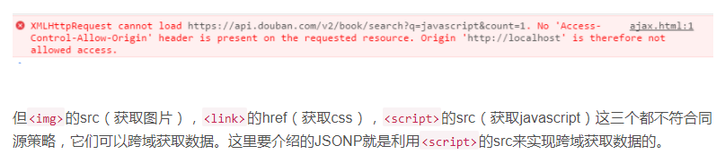

只要出现这个错误，就说明服务器接口不支持跨域//No 'Access-Control-Allow-Origin' header is present on the requested resource这是因为不同源，所以无法访问其他服务器的数据
但是 ** 的 src ( 获取图片 ) ,  的 href （获取css）， 的 src （获取js）这三个属性都不符合同源策略，它们可以跨域获取数据。JSONP就是利用<script> 的 src 来实现跨域获取数据。**
**跨域原理**  JSONP实现跨域请求的原理，简单的说，就说动态创建 <script>标签，然后利用<script>的 src 不受同源策略的约束来跨域获取数据。  JSONP 由两部分组成：回调函数和数据。回调函数 是当响应到来时，应该在页面中调用的函数。回调函数的名字，一般是在请求中指定的。而数据就是传入回调函数中的 JSON 数据。
**注意：JSONP不是真正的 ajax** **ajax是异步的，jsonp是同步的，所以它不是真正的ajax**
动态创建 <script> 标签，设置其 src ，回调函数在 src 中设置：

```
var script = document.createElement("script");
script.src = "https://api.douban.com/v2/book/search?q=javascript&count=1";
document.body.insertBefore( script, document.body.firstChild );
```

 在页面中，返回的 JSON 作为参数传入 回调函数中，我们通过回调函数来 操作数据 

```
function handleResponse(response){
    //对 response 数据进行操作代码
}
```

  了解了 JSONP 的基本使用方法，我们在实现上面，通过 ajax 调用豆瓣接口的需求，实现代码如下：   

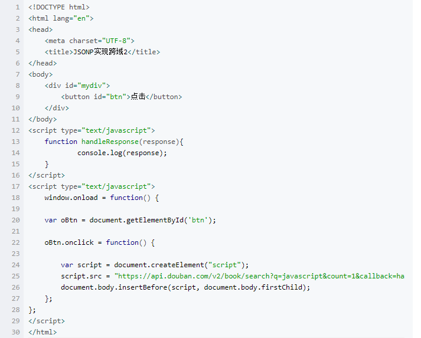

注意：以上代码中，要记得成功访问完数据后，要删除创建的动态 <script>标签：

document.body.removeChild(script)

其实在接口数据的形式类似：fn( { name: "张三" , age: "20" } ) ，我们传递过去一个和这个函数名字相同的回调函数，参数就是访问到的数据。

假如接口是： http://api.money.126.net/data/feed/0000001,1399001?callback=refreshPrice

函数名就是 callbanck = 的值：refreshPrice.

JSONP目前还是比较流行的跨域方式，虽然JSONP使用起来方便，但是也存在一些问题：如果其他域不安全，很可能会在响应中夹带一些恶意代码。而且要确定 JSONP请求是否失败并不容易。

JSONP有个限制，只能用GET请求，并且要求返回JavaScript

更多跨域的方法介绍：

https://www.liaoxuefeng.com/wiki/001434446689867b27157e896e74d51a89c25cc8b43bdb3000/001434499861493e7c35be5e0864769a2c06afb4754acc6000

**对axios有更进一步的理解，利用cros进行跨域处理！！！**

### CROS跨域

```

```


### 反向代理

```

```


### 什么是闭包

```
概念： 闭包就是能够读取其他函数内部变量的函数。
    由于函数内部的子函数才能读取局部变量，因此可以把闭包简单理解成“定义在一个函数内部的函数”（然后将这个内部的函数 return 返回出来）。
    所以，在本质上，闭包就是将函数内部和函数外部连接起来的一座桥梁。
    
    闭包的作用：它最大的用处有两个： 1） 一个是可以读取函数内部的变量；
                                                           2） 另一个就是让这些变量的值始终保存在内存中。

    使用闭包的注意点：1） 由于闭包会使得函数中的变量都保存在内存中，内存消耗很大，所以不能滥用闭包，否则会造成网页的性能问题，在IE中可能导致内存泄漏。解决方法是，在退出函数之前，将不使用的局部变量全部删除。
                                    内存泄漏：程序的运行需要内存。对于持续运行的服务进程，必须及时释放不再用到的内存，否则占用越来越高，轻则影响系统性能，重则导致进程崩溃。不再用到的内存，没有及时释放，就叫做内存泄漏。
http://www.ruanyifeng.com/blog/2017/04/memory-leak.html
                                    
                                   2） 闭包会在父函数外部，改变父函数内部变量的值。所以，如果你把父函数当作对象（object）使用，把闭包当作它的公用方法，把内部变量当作它的私有属性，这时一定要小心，不要随便改变父函数内部变量的值。
                                   
1、闭包是什么？

闭包时有权限访问 其他函数作用域的局部变量 的一个函数

这是《 JavaScript高级程序设计 》中给出的定义， 如果你想用一句话就把面试官搞定几乎是不可能的。

因为这句话还存在下面几个深入的问题：

	* 
为什么其他非闭包的函数，没有权限访问另一个函数的内部作用域
	* 
为什么闭包有这个权限
	* 
什么是函数作用域


面试官更想知道的是你是否知道上面的内容

更周全的解释方法：

由于在JS中，变量的作用域属于函数作用域，在函数执行后作用域就会被清理、内存也随之被收回，但是由于闭包时建立在一个函数内部的子函数，由于其可访问上级作用域的原因，即使上级函数执行完，作用域也不会随之销毁，这时的子函数---也就是闭包，便拥有了访问上级作用域中的变量的权限，即使上级函数执行完后，作用域内的值也不会被销毁。
稍微有些啰嗦，但是一分钟以内应该足够了。这样一来，面试官基本上了解了你对于上面三个知识点的是掌握的。

2、闭包解决了什么？

请放心，就凭上面那段话，面试官是不会善罢甘休的。他一定会继续追问，一般来说会问---闭包解决了什么问题。

阮一峰在他的博客中写到：在本质上，闭包就是将函数内部和函数外部连接起来的一座桥梁。

务实一点的说法应该是下面这样：

由于闭包可以缓存上级作用域，那么就使得函数外部打破了“函数作用域”的束缚，可以访问函数内部的变量。以平时使用的 AJAX 成功回调为例，这里其实就是个闭包，由于上述的特性，回调就拥有了整个上级作用域的访问和操作能力，提高了极大的便利。开发者不用去学钩子函数来操作上级函数作用域内部的变量了

    闭包最大的用处有两个： 1） 一个是可以读取函数内部的变量；
                                          2） 另一个就是让这些变量的值始终保存在内存中。

3、闭包有哪些应用场景

这个问题也极有可能被追问


闭包随处可见，一个 Ajax 请求的成功回调，一个事件绑定的回调方法，一个 setTimeout 的延时回调，或者一个函数内部返回另一个匿名函数，这些都是闭包。简而言之，无论使用何种方式对函数类型的值进行传递，当函数在别处被调用时，都有闭包的身影


4、使用闭包应该注意什么

代码难以维护：闭包内部是可以上级作用域，而如果闭包又是异步执行的话，一定要清楚上级作用域都发生了什么，而这样就需要对代码的运行逻辑和JS运行机制相当了解才能弄明白究竟发生了什么。

使用闭包的注意点：1） 由于闭包会使得函数中的变量都保存在内存中，内存消耗很大，所以不能滥用闭包，否则会造成网页的性能问题，在IE中可能导致内存泄漏。解决方法是，在退出函数之前，将不使用的局部变量全部删除。
                                    内存泄漏：程序的运行需要内存。对于持续运行的服务进程，必须及时释放不再用到的内存，否则占用越来越高，轻则影响系统性能，重则导致进程崩溃。不再用到的内存，没有及时释放，就叫做内存泄漏。

总结
原理比较深奥：想要完全掌握闭包，一定要弄清楚 函数作用域、内存回收机制、作用域继承 等，然而闭包时随处可见的，很可能开发者在不经意间就写出了一个闭包，理解不够深入的话，很可能造成运行结果与预期不符。

如果掌握了闭包并运行自如的话，会让你的“功力大增”                     
```


### JavaScript中如何检测一个变量是一个String类型，请写出函数实现

```

```

### localhSttorage、sessionStorage和cookie之间的区别

```

```

### 简述一下JQuery中的each

```

```

### JQuery中outerheight和height的区别

```

```

### 如何判断数据类型为数组（用尽可能多的方法）

```

```

### JavaScript中数组迭代有哪些方法

```

```

### 不适用框架的情况下，页面上有个list里面有很多item，每个item点击都要展示不同内容，怎么做（口述）

```

```

### JQuery动画队列怎么控制

```

```

### 谈一下mvc、mvvm模型

```
MVC 即 Model-View-Controller 的缩写，就是 模型—视图—控制器，也就是说一个标准的Web 应用程式是由这三部分组成的：
　　View ：用来把数据以某种方式呈现给用户
　　Model ：其实就是数据
　　Controller ：接收并处理来自用户的请求，并将 Model 返回给用户
MVVM 是Model-View-ViewModel 的缩写，它是一种基于前端开发的架构模式，其核心是提供对View 和 ViewModel 的双向数据绑定，这使得ViewModel 的状态改变可以自动传递给 View，即所谓的数据双向绑定
在MVVM架构下，View 和 Model 之间并没有直接的联系，而是通过ViewModel进行交互，Model 和 ViewModel 之间的交互是双向的， 因此View 数据的变化会同步到Model中，而Model 数据的变化也会立即反应到View 上
viewModel 通过双向数据绑定把 View 层和 Model 层连接了起来，而View 和 Model 之间的同步工作完全是自动的，无需人为干涉，因此开发者只需关注业务逻辑，不需要手动操作DOM， 不需要关注数据状态的同步问题，复杂的数据状态维护完全由 MVVM 来统一管理
```

### 模块化怎么管理，如果没有webpack怎么管理模块化

```

```

### 父子组件怎么传值

```

```

### 事件冒泡，事件委托

```

```

### 动态常见的元素绑定事件绑定不上怎么解决

```

```

### es6中的箭头函数和普通函数有什么区别

```
1.普通函数中的 this总是指向调用它的那个对象，
箭头函数没有自己的this,他的this永远指向其定义环境，任何方法都改变不了其指向，如call()、bind()、apply()。（正是因为它没有this，所以也就不能用作构造函数，也没有原型对象）
2.箭头函数不能当作构造函数，也就是说，不能使用new命令，否则会报错。
3.箭头函数没有原型属性。
4.箭头函数不可以使用yield命令，因此箭头函数不能用作Generator函数。
5.箭头函数不能使用arguments对象，该对象在函数体内不存在。如果要用，可以用rest参数代替。
6.变量提升：由于js的内存机制，function的级别最高，而用箭头函数定义函数的时候，需要var（let、const）关键字，而var所定义的变量不能得到变量提升。故箭头函数一定要定义于调用之前。
```

### this的指向问题

```
{ } ; 系统内置的函数对象： Function , Object , Array , String , Number
             
                2、 普通对象： 除开函数对象之外的对象，都是普通对象
                每个普通对象的__proto__属性，都指向 Object（）.prototype ，
                var obj = { }  就等于  var obj = new Object ( ) ;  即普通对象是  构造函数( Object ) 的一个实例
                所以  obj. __proto__    ===  Object.prototype  ( 但是老高说的，Object的原型还是object对象, )
                          obj. constructor  ===  Object 
    凡是通过 new Function() 创建的对象都是函数对象，其他的都是普通对象。
    注：所有对象都有 __proto__ 属性 只有函数对象才有 prototype 属性 ！！！！！！！！！！！


    原型对象： prototype 属性也叫原型对象，主要是为了实现继承；
    
     指针 __proto__ :  js中，万物皆对象！所有的对象 obj 都具有 proto 属性（null 和 undefined除外 )，而且指向创造obj 对象的函数对象（生成实例的构造函数）的prototype属性 。 如以下例子：

```

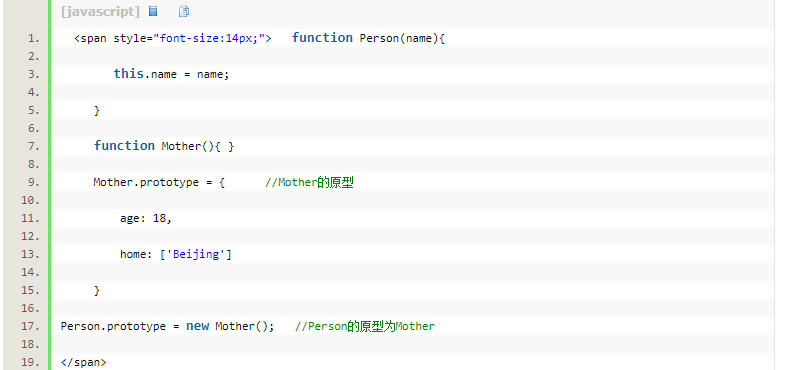

  Person 构造函数的原型对象 是 Mother （）。相当于原型是妈妈，Person现在是儿子。   

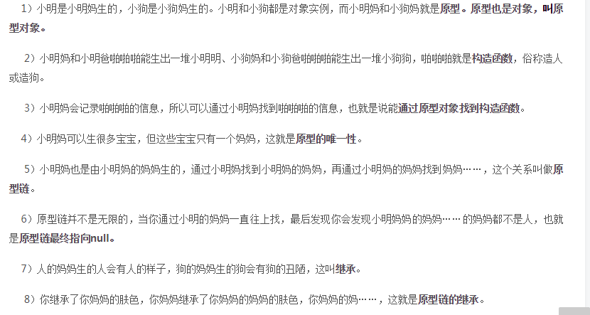

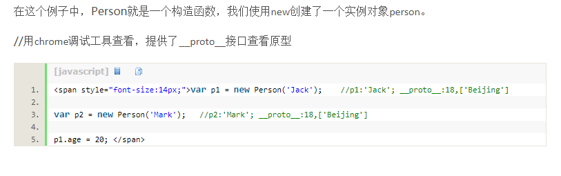

在 p1 和 p2 实例中，__proto__属性，指向的是 创造他们的构造函数Person 对象的 prototype 属性，所对应的对象。也就是 Mother（）.
一个构造函数对象的原型，就相当于 他妈，这个构造函数对象的实例，就相当于 他妈不同的孩子。而 每个 实例中的 __proto__属性，就指向 他们共同的 妈 ！也就是 构造函数对象的 prototype属性。


当我们输入 p1.name 的时候，原型链的搜索机制是先在实例中搜索相应的值，找不到就通过它的__proto__指针，在原型中找，还找不到就再往上一级原型中搜索……一直到了原型链的终点( 就是js自带的Object，它的原型比较特殊，为null )，就是到null还没找到的话，就返回一个 undefined。


  构造器constructor : 每一个对象中的constructor 属性返回创建此对象的函数对象的引用；例如：   functon Dog ( name, color ) {     this. name = name;     this. color = color;   }  var dog1 = new Dog( "小白" , "白色" );  dog1.constructor == Dog 构造函数本身

**在默认情况下，所有的原型对象都会自动获得一个 constructor（构造函数）属性，这个属性（是一个指针）指向 prototype 属性所在的函数（Person）**
**上面这句话有点拗口，我们「翻译」一下：A 有一个默认的 constructor 属性，这个属性是一个指针，指向 Person。即：****Person.prototype.constructor == Person**
**实例的构造函数属性（constructor）指向构造函数 ：person1.constructor == Person**


**person1 为什么有 constructor 属性？那是因为 person1 是 Person 的实例。****那 Person.prototype 为什么有 constructor 属性？？同理， Person.prototype （你把它想象成 A） 也是Person 的实例。****也就是在 Person 创建的时候，创建了一个它的实例对象并赋值给它的 prototype，基本过程如下：****var A = new Person();****Person.prototype = A;**
**结论：原型对象（Person.prototype）是 构造函数（Person）的一个实例。**
以下代码的图示       function Foo ( ) { } ;         var f1 = new Foo;

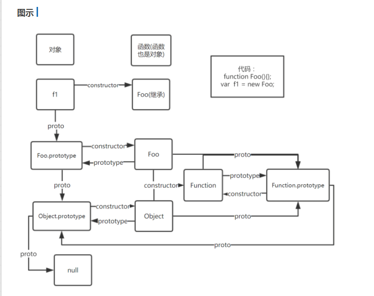

以下是 深入解答原型是怎么回事 的一篇文章 

1、https://www.jianshu.com/p/dee9f8b14771

2、https://www.jianshu.com/p/652991a67186

3、https://www.jianshu.com/p/a4e1e7b6f4f8  

原型链的概念如果问原型链是什么，直接把下面的这张图画出来就行了。

https://www.cnblogs.com/shuiyi/p/5305435.html

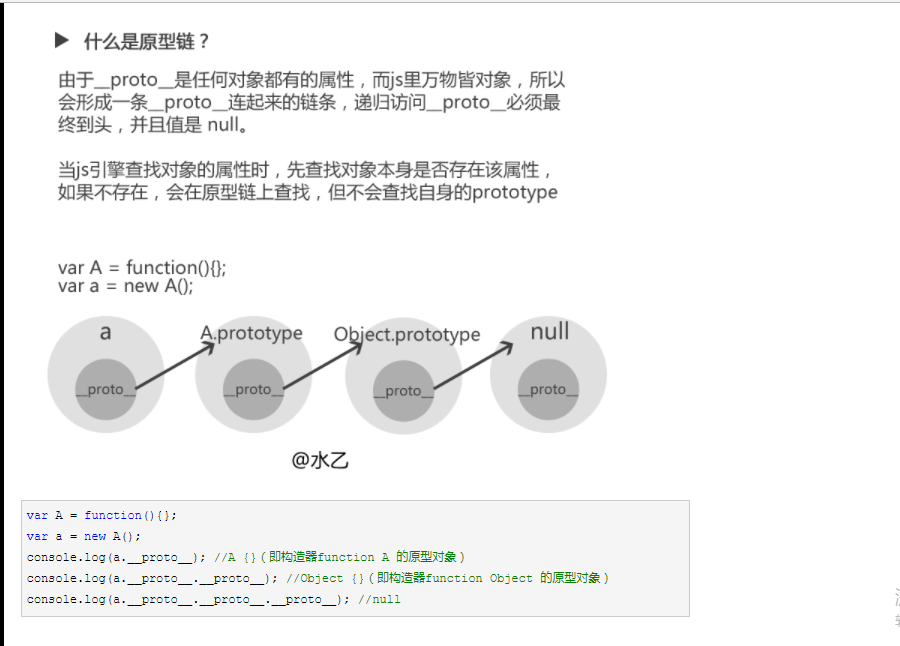

```
回答出以下问题，就知道 __proto__和prototype 的什么了
function Person（）{   } ；
var person1 = new Person( );


person1.__proto__ 是什么？

Person.__proto__ 是什么？

Person.prototype.__proto__ 是什么？

Object.__proto__ 是什么？

Object.prototype__proto__ 是什么？


答案：
第一题：
因为 person1.__proto__ === person1 的构造函数.prototype
因为 person1的构造函数 === Person
所以 person1.__proto__ === Person.prototype
第二题：
因为 Person.__proto__ === Person的构造函数.prototype
因为 Person的构造函数 === Function
所以 Person.__proto__ === Function.prototype
第三题：
Person.prototype 是一个普通对象，我们无需关注它有哪些属性，只要记住它是一个普通对象。
因为一个普通对象的构造函数 === Object
所以 Person.prototype.__proto__ === Object.prototype
第四题，参照第二题，因为 Person 和 Object 一样都是构造函数
               不要把 Object 想的太复杂，它其实也不过是 Function 构造出来的一个 方法 （一个普通的构造函数）
                所以 Object.__proto__ === Function.prototype
第五题：
Object.prototype 对象也有proto属性，但它比较特殊，为 null 。因为 null 处于原型链的顶端，这个只能记住。
Object.prototype.__proto__ === null
记住：prototype是一个普通对象，所有普通对象的__protp__都指向 Object.prototype

```

### promise的用法和原理

基础[https://mengera88.github.io/2017/05/15/promise%E5%AD%A6%E4%B9%A0%E7%AC%94%E8%AE%B0/](https://mengera88.github.io/2017/05/15/promise学习笔记/)

原理https://segmentfault.com/a/1190000009478377

```
 {
//待处理的异步逻辑
//处理结束后，调用resolve或reject方法
})
新建一个promise很简单，只需要new 一个 Promise 对象即可。所以promise本质上就是一个函数，它接受一个函数作为参数，并且返回promise对象，这就给链式调用提供了基础。

特点：
1、对象的状态不受外界影响。
Promise 的实例 有以下三种状态：
    1）pending : 进行中
    2）resolved : 已成功完成
    3）rejected : 已失败
只有异步操作的结果，可以决定当前是哪一种状态，任何其他操作都无法改变这个状态。

2、一旦状态改变，就不会再变，任何时候都可以得到这个结果。Promise对象的状态改变，只有两种可能：从pending变为resolved；从pending变为rejected。 只要这两种情况发生，状态就凝固了，不会再变了，会一直保持这个结果。
基本用法：
ES6规定，Promise 对象是一个构造函数，用来生成Promise实例

```

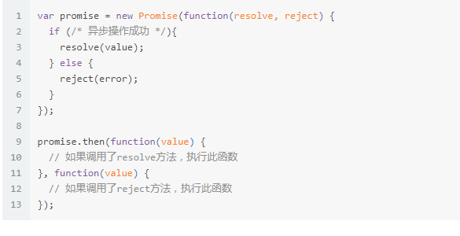

Promise构造函数接受一个函数作为参数，该函数的两个参数分别是resolve和reject。它们是两个函数，由JavaScript 引擎提供， 不是自己部署。
resolve函数的作用，将Promise对象的状态从“进行中”变成 “成功”( 即从pending变为resolved ) ，在异步操作成功时调用，并将异步操作的结果，作为参数传递出去。reject函数的作用，在异步操作失败时调用，并将异步操作报出的错误，作为参数传递出去。
Promise实例生成以后，可以用then方法分别制定 Resolved状态和Rejected状态的回调函数：

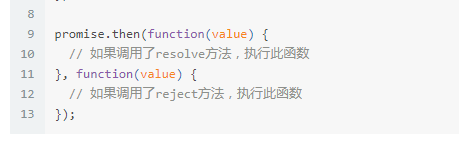

then方法可以接受 2 个回调函数作为参数，第二个函数是可选的，不一定要提供。这两个函数都接受Promise对象传出的值作为参数。
promise捕获错误 .catch方法：   Promise.prototype.catch方法是Promise.prototype.then(null, rejection)的别名，用于指定发生错误时的回调函数。

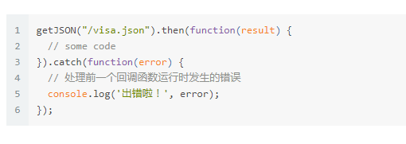

  Promise对象的错误具有“ 冒泡 ”性质，会一直向后传递，直到被捕获为止。也就是说，错误总是会被下一个catch语句捕获。   

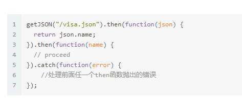

  题外话：async 函数是es7 提案出来的语法， async函数是用来取代回调函数的另一种方法。   


```
当面试官问你 Promise 的时候，他究竟想听到什么？

如果你面试的岗位中要求会 nodejs的话，Promise 的问题是必不可少的。
关于Promise 的问题一览

	* 
什么是 promise
	* 
传统的回调式异步操作有什么缺点？（Promise是如何解决异步操作）
	* 
Promise中的异步模式有哪些？有什么区别？
	* 
如果想 Promise.all（）和Promise.race（）传递空数组，运行结果会有什么不同？
	* 
如何确保一个变量是可信任的 Promise（Promise.resolve方法传入不同值的处理有哪些）
	* 
Promise是如何捕获异常的？与传统的 try / catch 相比有什么优势？


解答如下：
    1、什么是promise
    下面的回答很像在背概念，但是很精辟


所谓Promise，简单说就是一个容器，里面保存着某个未来才会结束的事件的结果。从语法上说，Promise 是一个对象，从它可以获取异步操作的消息。Promise 提供统一的API ，各种异步操作都可以用同样的方法进行处理，让开发者不用关注于时序和底层的结果。Promise 的状态具有不受外界影响和不可逆两个特点。

    2、传统的回调式异步操作有什么缺点？（Promise是如何解决异步操作）

传统的回调有五大信任问题：
1）调用回调过早
2）调用回调过晚（或没有被调用）
3）调用回调次数过少或过多
4）未能传递所需的环境和参数
5）吞掉可能出现的错误和异常
    
    Promise 的解决办法：

1）调用回调过早
对于Promise 来说，即使是立即完成的 Promise 也无法被同步观察到，也就是说一个Promise调用 then() 的时候，即使这个 Promise 已经决议了，提供给 then的回调也总会被异步调用。

2）调用回调过晚（或没有被调用）
对于一个 Promise 对象注册每一个观察回调都是相对独立、互不干预的。而 Promise 对象调用 resolve() 和 reject() 时，每个注册的观察回调也都会被自动调用。所以这些观察回调的任意一个都无法影响或延误对其他回调的调用。
此外，关于回调未调用，正常情况下，没有任何东西可以阻止 Promise 想你通知它的决议，即使你的 js代码报错了，一会通过异常回调来获取到。如果Promise 永远不被决议的话， Promise 本身已提供了竞态的抽象机制来作为解决方案

3）调用回调次数过少或过多
promise 的定义方式使得它只能被决议一次。即使代码中出现多次决议，这个 Promise 也会接受第一次决议，并会忽略掉其他任何后续调用。所以任何通过 then() 注册的回调只会被调用一次

4）未能传递所需的环境和参数
凡是被决议的值，都会被传递到观察回调中，如果没有显示的决议也会传递一个 undefined 给观察回调。需要主要的是，Promise 只允许传一个决意值，其他值会被默默忽略掉

5）吞掉可能出现的错误和异常
如果在创建 Promise 时，存在 JS 代码错误，会直接导致该 Promise 的拒绝决议，那么你可以通过 reject() 来获取异常，代码中的任何异常都不会吞掉。

以上的回答十分的啰嗦，但是如果上面的五点都能记住的话，会了解很多关于 Promise 的细节问题，也会应对一些面试官的追问，如 Promise的 then（）会不会被重复调用等。

    3、Promise 中的异步模式有哪些？有什么区别？
这个问题会把面试者问懵。。。可以考虑另一种问法，或者直接进入下一个问题。
说一说 Promise.all( ) 和 Promise.race( ) 的区别。因为 ES6中的 Promise中只有这两个模式 all 和 race，其他的如 first、any、last等都是其他 Promise库提供的。
Promise.all( ) 和 Promise.race( ) 的区别
all会将传入的数组中的所有 Promise 全部决议以后，将决议值以数组的形式传入到观察回调中，任何一个 Promise决议为拒绝，那么就会调用拒绝回调

race会将传入的数组中的所有 promise 中第一个决议的决议值传递给观察回调，即使决议结果是拒绝的。

4、如果向Promise.all( ) 和 Promise.race( )传递空数组，运行结果会有什么不同？

all会立即决议，决议结果是 fullfilled, 值是 undefined
race会永远都不决议，程序卡死。。。

5、如何确保一个变量是可信任的Promise（Promise.resolve方法传入不同值的不同处理有哪些）

可以通过 Promise.resolve( )方法对不确定的值进行 Promise化，返回一个Promise对象。

如果是一个立即值，比如一个普通变量，那么该Promise会立即决议为成功
如果是一个Promise值，那么会将该Promise直接返回赋值给这个Promise，不会有额外开销
如果是一个类Promise值，比如其中含有名称为 then的成员变量，那么会将 then展开形成一个新的 Promise对象。

6、Promise是如何捕获异常的？与传统的 try / catch 相比有什么优势？

传统的 try / catch 捕获异常方式是无法捕获异步的异常的，代码如下

try{
    setTimeout(function(){
        undefined();   // undefined 不是一个方法，会抛出异常
    }，500)
} catch(err){
    console.log(err)
}

而对于Promise对象来说，构造Promise实例时的代码如果出错，则会被认为是一个拒绝的决议，并会想观察回调中传递异常信息。所以即使是一个异步的请求，Promise也是可以捕获异常的，此外，Promise还可以通过 catch回调来捕获回调中的异常。

```


### 一个页面从输入URL到页面加载显示完成，这个过程都发生了什么

```
分为以下四个步骤：

	1. 
当发送一个 URL 请求时，不管这个 URL 是 Web页面的 URL，还是Web页面上每个资源的 URL，浏览器都会开启一个线程来处理这个请求，同时在远程 DNS 服务器上启动一个 DNS 查询。这能使浏览器获得请求对应的IP地址。
	2. 
浏览器与远程 Web 服务器 通过 TCP三次握手协商来建立一个 TCP / IP连接。该握手包括一个同步报文，一个同步--应答报文和一个应答报文，这三个报文在浏览器和服务器之间传递。该握手首先由客户端尝试建立起通信，而后服务器应答并接受客户端的请求，最后由客户端发出该请求已经被接受的报文。
	3. 
一旦TCP / IP 连接建立，浏览器会通过该连接向远程服务器发送 HTTP的GET请求。远程服务器找到资源并使用 HTTP 响应返回该资源，值为200 的HTTP 响应状态表示一个正确的相应。
	4. 
此时，Web 服务器提供资源服务，客户端开始下载资源。


```

### 面向对象和面向过程各有什么优点

```
面向过程：
                优点：性能比面向对象高，因为类调用时需要实例化，开销比较大，比较消耗资源。
                缺点：没有面向对象易维护、易服用、易扩展。
    面向对象（OOP）：
                优点：易维护、易复用、易扩展。由于面向对象有封装、继承、多态的特性，可以设计出低耦合的系统，使系统更加灵活、更加易于维护。
                缺点：性能比面向过程低。

     有人这么形容OP和OO的不同：用面向过程的方法写出来的程序是一份蛋炒饭，而用面向对象写出来的程序是一份盖浇饭。
     　盖浇饭的好处就是"菜""饭"分离，从而提高了制作盖浇饭的灵活性。饭不满意就换饭，菜不满意换菜。用软件工程的专业术语就是"可维护性"比较好，"饭" 和"菜"的耦合度比较低。蛋炒饭将"蛋""饭"搅和在一起，想换"蛋""饭"中任何一种都很困难，耦合度很高，以至于"可维护性"比较差。

```

### ES6具体指的是什么？列举并解释你常用的ES6新方法机器作用

 http://es6.ruanyifeng.com/#docs/letES6是[ECMAScript](https://www.google.com/url?sa=t&rct=j&q=&esrc=s&source=web&cd=1&cad=rja&uact=8&ved=0CCoQFjAA&url=http%3A%2F%2Fen.wikipedia.org%2Fwiki%2FECMAScript&ei=Q99JU5jwAoGC8gWq9YDoCQ&usg=AFQjCNGgS-TjEL_-efubqc1RnkUfmn6wew&sig2=Kx2DkQ1Qtv0Wu2E_v_fwGQ&bvm=bv.64542518,d.dGc) 的第6个版本，2015年发布

```
差不多，都是指向定义时所在的环境
4、解构赋值     1）数组的解构赋值   

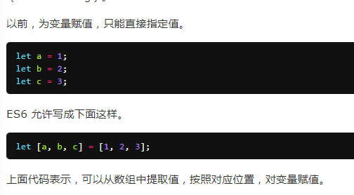


   2）对象的解构赋值   

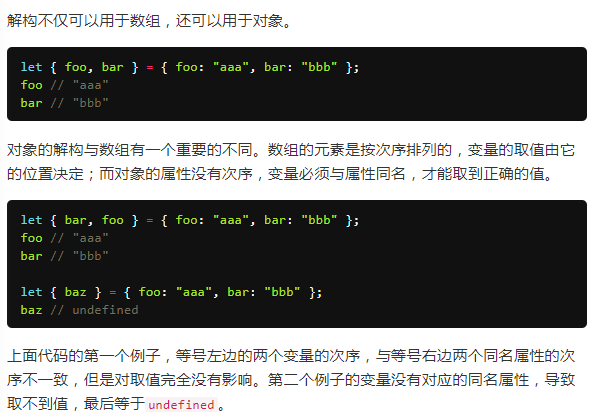

5、ES6 标准的 Promise
6、for .. of .. 遍历  **for in是ES5标准，遍历key.** **for of是ES6标准，遍历value.**
  遍历数组通常使用for循环，ES5的话也可以使用 forEach ，ES5具有遍历数组功能的还有map( forEach没有返回值，map有返回值，）、fiter（过滤关键字）、some（判断数组中是否有符合条件的元素，如大于10）、every（判断是否所有的元素都符合条件）、reduce（累加器）等。只不过他们的返回结果不一样，但是使用 foreach遍历数组的话，使用break不能中断循环，使用return也不能返回到外层函数。

```
Array.prototype.method = function(){
    console.log(this.length)
}

var myArray = [1,2,3,4,5,6,7]
myArray.name = "数组"
for(var index in myArray){
    console.log(myArray[index])
}

```

使用 for in 也可以遍历数组，但是会 存在以下问题index索引为字符串型数字，不能进行运算几何运算遍历顺序有可能不是按照数组的内部顺序使用 for in 会遍历数组所有的可枚举属性，包括原型。例如上例的原型方法method和name属性
  所以for in更适合遍历对象，不要使用for in 遍历数组那么除了使用for 循环，如何更简单的正确的遍历数组达到完美的期望呢（即不遍历 method和name）。ES6中的 for of 更胜一筹

var myArray = [1,2,3,4,5,6,7]for(let value of myArray){  console.log(value)}**记住，for in 遍历的是数组的索引， 而 for of遍历的是数组元素的值**
**for of 遍历的只是数组内的元素，而不包括数组的原型属性 method 和索引 name**
**遍历对象，通常用 for in 来遍历对象的键名**Object.prototype.method = function(){  console.log(this)}var myObject = {  a:1,  b:2,  c:3}
for(let key in myObject){  console.log(key)}
**for in 可以遍历到 myObject的原型方法 method，如果不想遍历原型方法和属性的话，可以在循环内部判断一下，hasOwnPropery方法可以判断某属性是否是该对象的实例属性**


7、Class 类

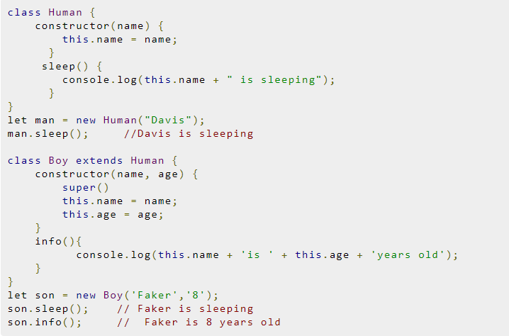


8、 Module 模块 ： import 导入模块， export 导出模块

9、拓展的对象功能     1）对象初始化简写。        es5如果出现键值对重名的，可以简写     

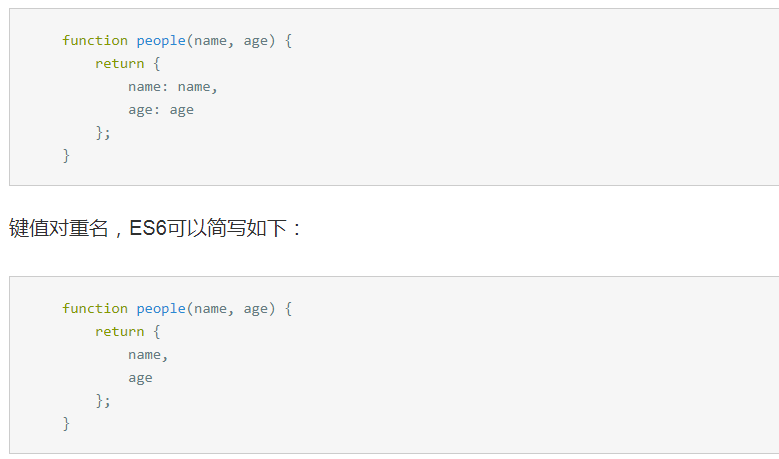

  2）es6通过省略冒号与 function 关键字，为对象添加方法：   

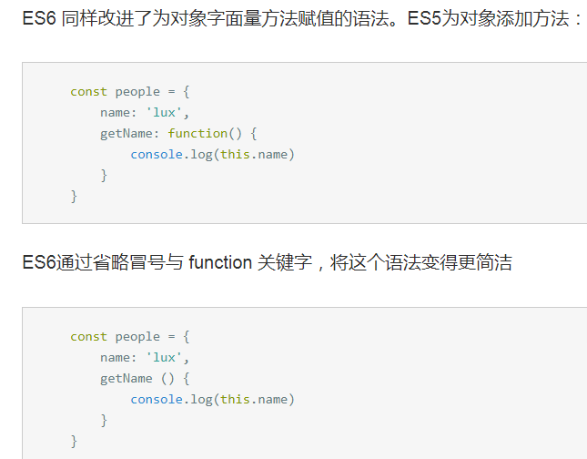

9、展开运算符   ES6 中一个好玩的特性就是 展开运算符 也是三个点儿 ...  

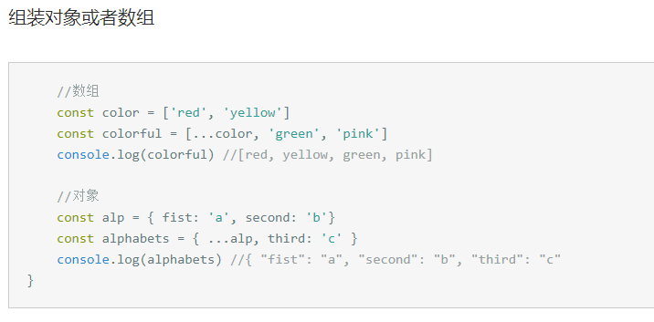

10、Set 和 Map 数据结构    1） Set         ES6提供了新的数据结构Set。它类似于数组，但是成员的值都是唯一的，没有重复的值。     Set 本身是一个构造函数，用来生成数据结构。     Set 函数可以接受一个数组 作为参数，用来初始化 

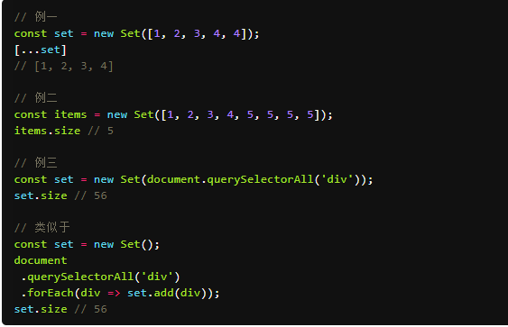

 利用扩展运算符 [ ...set ] 可以将 set 类数组数据，转换成一个真正的数组      上述代码也展示了一种去除数组重复成员的方法。   

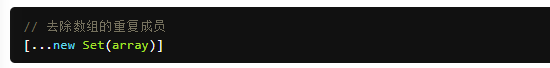

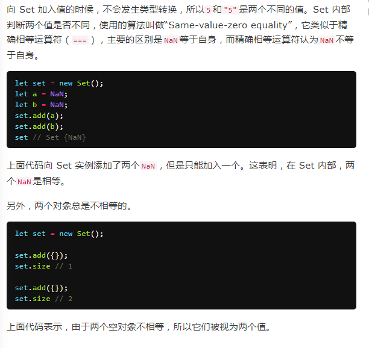

  Set 实例的属性和方法   

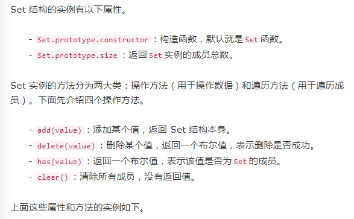

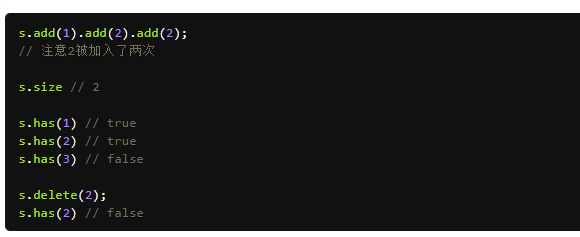


  Arra. from 方法也可以 将 Set 结构 转为 数组   

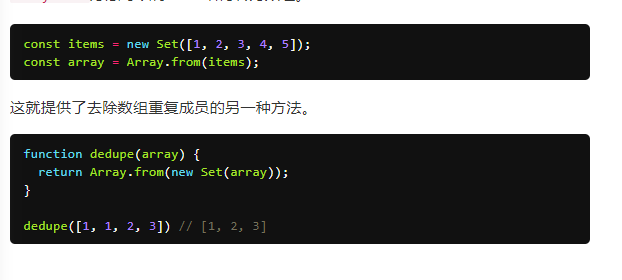

  扩展运算符 ( ... ) 和 Set 结构相结合， 就 可以去除数组的重复成员。   

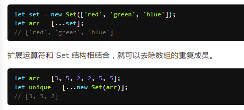

[Babel](https://babeljs.io/)是一个广泛使用的转码器，可以将ES6代码转为ES5代码，从而在现有环境执行。Babel的配置文件是.babelrc，存放在项目的根目录下。

### 列举你常用的JS数组的元素方法，并用一句话概括

```
1、push ： 把一个元素 或 一组元素（数组）添加到当前数组的末尾。
2、pop ：删除数组中最后一个元素，并返回删除的元素。
3、concat：该方法会把两个数组或元素组合在一起，但是不会改变调用者的结构。
      var arr3 = arr1. concat ( arr2 );
4、splice ：删除指定的元素，或者插入指定的元素。该方法有三个参数
        第一个：index，表示要删除的开始下标；
        第二个：表示要删除的元素个数；如果要增加元素，则设置为 0 ；
        第三个：可选参数，从index 开始，要插入的元素。
        该方法返回值是被删除掉的那部分数组。
        var arr1 = [1, 2, 3, 4, 5];
  var arr2 = arr1.splice(0, 2);
  alert(arr1); // [3, 4, 5]
    alert(arr2);  // [1, 2]
5、slice：返回指定数组的一个片段或子数组。里面可以传一个参数或两个参数，参数可以为正，也可以为负
        第一个参数：表示开始的位置，索引。
        第二个参数：数组索引结束为止（但不包含）。
        如果有负数，则倒数第一个是 -1，倒数第二个是 -2，一次类推
6、reverse ： 颠倒数组中元素的顺序；
7、join：返回一个字符串，字符串的内容是数组的所有元素，元素之间通过制定的分隔符进行分隔，分隔符就是join的参数
（ unshift：在数组最前面添加一个元素或一组元素；shift ：删除数组最前面一个元素，返回删除的元素）

列举你常用的 JS 字符串的原生方法，并用一句话去描述

```


### JS的事件机制或JS处理事件的过程

https://blog.csdn.net/crystal6918/article/details/52918710**(详细)**

https://www.cnblogs.com/lazychen/p/5664788.html

```
 添加的事件处理程序，只能使用 removeEventListener( ) 移除。
        移除时，传入的参数与添加处理程序时使用的参数相同。这也意味着，通过 addEventListener（）添加的 匿名函数 将无法移除
    

        DOM2级规定的事件流包括三个阶段：事件捕获阶段、处于目标阶段、事件冒泡阶段。

	* 
首先发生的是事件捕获，为截获事件提供了机会
	* 
然后实际的目标接收到事件
	* 
然后冒泡阶段发生，事件又传播回文档            
```

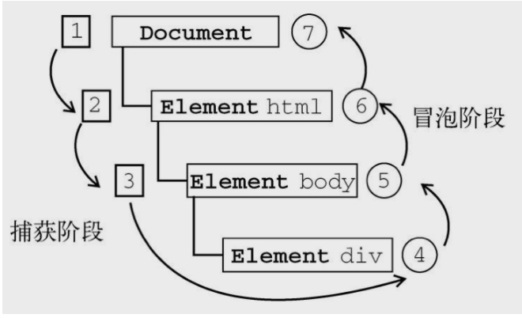

```
在DOM事件流中，实际的目标在捕获阶段不会接受任何事件 ，这意味着在捕获阶段，事件从 document 到 <html> 再到 <body> 后就停止了。
下一个阶段是 ”处于目标阶段“，于是事件在 div 元素上发生，并在事件处理中被看成冒泡阶段的一部分
即使 DOM2级事件 明确要求 捕获阶段 不会涉及事件目标，但大多数浏览器 都会在捕获阶段触发事件对象上的事件， 结果就是有两个机会在目标对象上面操作事件。


 3、事件对象
       触发某个事件时，会生产一个事件对象 event，这个对象包含了所有与事件有关的信息。常用的有与事件源 target , 利用 target 属性，可以实现事件委托，把这个事件 添加给父元素身上，因为冒泡机制，通过 target 判断触发的对象，从而实现后续操作。
例如： 点击任何一个 li ，该点击事件依然会冒泡到父元素 ul 上，所以直接将点击 li 后要做的事写到了父元素的点击事件里；通过 target 来判断事件源是否是 li 标签。

    在IE中的事件对象
    如果使用DOM0级 方法添加事件处理程序时，event对象作为 window 随想的一个属性存在：

btn.onclick = function(){
    var event = window.event;
    console.log(event.type) // click
}
    如果事件处理程序是通过 attachEvent( ) 添加的，那么就会有一个 event 对象作为参数被传入事件处理程序的函数中：

btn.attachEvent("onclick", function(event){
    console.log(event.type) // click
})

所以在获取 事件对象的兼容性写法是： 

btn.onclick = function(event) {
    var evt = event || window.event;
}

扩展：事件源 target 和 srcElement
    IE浏览器中没有 event.target 属性，但是他的 event.srcElement 属性和 target 属性相同
所以获取事件源的兼容性写法：
    var target = event.target || event.srcElement


4、IE事件处理程序
IE实现了与DOM中类似的链，各个方法：attachEvent( ) 和 detachEvent( )。
这两个方法接受相同的两个参数，事件处理程序名称与实践处理程序函数。
由于IE8及更早版本只支持事件冒泡，所以通过attachEvent( )添加的事件处理程序都会被添加到冒泡阶段
与 addEventListener(）不同的是，　attachEvent 第一个参数，事件处理程序名称要加“on”,


btn.attachEvent("onclick", function(){ });
    注意：在IE中使用 attachEvent( ) 与使用 DOM 0级方法的主要区别在于事件处理程的作用域。在使用 DOM 0 级方法的情况下，事件处理程序会在其所属元素的作用域内运行。在使用 attachEvent（）方法的情况下，事件处理程序会在全局作用域中运行，因此this等于window。

btn.attachEvent("onclick",function(){
    alert( this === window ) // ture
})

与 addEventListener( ) 类似，attachEvent( ) 方法也可以用来为一个元素添加多个事件处理程序。但与 addEventListener( )不同的是，这些事件处理程序不是以添加他们的顺序执行，而是以相反的顺序被触发。
attachEvent( ) 事件通过 detachEvent( ) 来移除，条件是必须提供相同的参数、这也意味着添加的匿名函数将不能被移除。

5、跨浏览器的事件处理程序（兼容写法）
要保证处理事件的代码能在大多数浏览器下在一致地运行，只需要关心冒泡阶段。
兼容写法：

var EventUtil = {
    addHandler: function(element, type, handler){
        if( element.addEventListener){
            element.addEventListener(type, handler, false)
        }else if{ element.attachEvent }{
            element.attachEvent('on' + type, handler)
        }else{
            element['on' + type ] = handler;
        }
    },

    removeHandler: function(element, type, handler){
            if( element.removeEventListener){
            element.removeEventListener(type, handler, false)
        }else if{ element.detachchEvent }{
            element.detachEvent('on' + type, handler)
        }else{
            element['on' + type ] = null ;

        }
    }
}

//在使用时
var btn = document.getElementById('btn');
var handler = function(){
    console.log(this)
}

EventUtil.addHandler( btn, 'click', handler);
EventUtil.removeHandler( btn, 'click', handler)


6、阻止冒泡
用于立即停止事件在 DOM 层次中的传播，即取消进一步的事件捕获或冒泡。
FF : event.stopPropagation( ) 方法可以阻止冒泡
IE中阻止冒泡的方法：window.event.cancelBubble = true;

7、阻止默认行为；
比如阻止 a 标签的跳转等浏览器默认的行为
FF 中 通过 event.preventDefault( ) 方法阻止默认行为

link.onclick = function(event){
    event.preventDefault();
}

IE中阻止默认行为是 window.event.returnValue = false ;默认是true，

link.onclick = function(event){
    window.event.returnValue = false;
}

两者都兼容的暴力方法： return false
这个方法比较暴力，它会同时阻止事件冒泡 和 阻止默认行为
可以理解为 return false 等同于同时调用了 event.stopPropagation() 和 event.preventDefault()

```

### e.target 与 e.currentTarget 的区别

  https://www.cnblogs.com/bo-haier/p/5644268.html   

```
target与 currentTarget两者既然有区别，也有联系，下面是两个例子解释两者的区别

<!DOCTYPE html>
<html>
<head>
    <title>Example</title>
</head>
<body>
    <div id = 'A'>
        <div id = 'B'>
            
        </div>
    </div>
</body>
</html>


var a = document.getElementById('A');
var b = document.getElementById('B');

function handler(e){
    console.log(e.target);
    console.log(e.currentTarget);
}
a.addEventListener('click', handler, false);

当点击A时，输出：

<div id = 'A'> ... </div>
<div id = 'B'> ... </div>
当点击B时，输出：


<div id = 'B'> ... </div>
<div id = 'A'> ... </div>

也就是说，currentTarget 始终是 监听事件者 ， 而 target 是 事件的 真正发出者。
换句话说，event.target指向引起触发事件的元素，而 event.currentTarget 则是事件绑定的元素

对象 this 、 currentTarget 和 target
在事件处理程序内部，对象 this 始终等于 currentTarget 的值， 而target 则只包含事件的实际目标。
如果直接将事件处理程序，指定给了目标元素， 则 this 、currentTarget 和 target 包含相同的值。
比如：


<input type = "button" id = "btn" value = "我是按钮" />
<script type = "text/javascript" >
    var btn = document.getElementById('btn');
    btn.onclick = function(e){
        console.log( e.currentTarget ) === this ); // ture
        console.log( e.target === this ) // ture  
    }
</script>
这个例子检测了 currentTarget 和 target 的值。由于 click 事件的目标就是按钮，因此，这三个值是相等的。

如果事件处理程序存在于按钮的 父节点 中，那么这些值是不相同的。看下面例子：


document.body.onclick = function(e){
    console.log( e.currentTarget === document.body ); // ture
    console.log( this === document.body ); // ture
    console.log( e.target === btn ); //ture
}
当单机这个例子中的按钮时， this 和 currentTarget 都等于 document.body , 因为事件处理程序是注册到这个元素的。
然而，target 元素却等于按钮元素，以为它是 click 事件真正的目标。由于按钮上并没有注册事件处理程序，结果 click 事件就冒泡到了
document.body ，在那里事件才得到了处理。

事件对象的 type 属性：在需要通过一个函数处理多个事件时，可以使用 type 属性。例如：


var btn = document.getElementById('btn');
var handler = function(event){
    switch ( event.type ){
        case "click":
            alert("Clicked");
            break;
        case "mouseover":
            event.target.style.backgroundColor = "orange";
            break;
        case "mouseout":
            event.target.style.backgroundColor = "";
            break
    }
}

btn.onclick = handler;
btn.onmouseover = handler;
btn.onmouseout = handler;

```

### 现在有一个场景，左边是菜单栏，右边是显示区域，点击菜单栏切换显示的内容，请尽可能多的说出你的方案

```

```

### get和post的区别

```
这题看上很简单，你肯定能答出1个以上的区别，但是面试官往往期望你能答出更多更深层次的区别。
这篇文章写的很详细了，大家可以研究一下——https://www.zhihu.com/question/28586791
我在这里在概括一下：
初级的答案
因为GET方法请求的参数都是放在请求的url上的，所以它与POST有以下明显的区别：
	* 
GET请求可以被添加到书签中，也可保存在浏览器历史记录中，POST不能
	* 
GET请求可以被浏览器缓存，POST不能
	* 
GET请求收到URL长度限制，所以数据长度也受限制，POST不会
	* 
GET请求只能传输ASCII字符，而POST不受此限制，还可以传输二进制数据


在语义上两个方法也有区别：
	* 
GET 代表获取指定服务器上资源
	* 
POST 代表向指定的资源提交要被处理的数据


高级些的答案
GET产生一个TCP数据包；POST产生两个TCP数据包。
对于GET方式的请求，浏览器会把http header和data一并发送出去，服务器响应200（返回数据）；
而对于POST，浏览器先发送header，服务器响应100 continue，浏览器再发送data，服务器响应200 ok（返回数据）。
也就是说，GET只需要汽车跑一趟就把货送到了，而POST得跑两趟，第一趟，先去和服务器打个招呼“嗨，我等下要送一批货来，你们打开门迎接我”，然后再回头把货送过去。
但是需要多解释两句的是：
	* 
据研究，在网络环境好的情况下，发一次包的时间和发两次包的时间差别基本可以无视。而在网络环境差的情况下，两次包的TCP在验证数据包完整性上，有非常大的优点。
	* 
并不是所有浏览器都会在POST中发送两次包，Firefox就只发送一次。


```

### mouseover 和 mouseenter 两个事件有什么区别？   

```
mouseenter不会冒泡
    详细解释一下：
    当二者绑定的元素都没有子元素时，二者的行为是一致的。但是二者内部都包含子元素时，行为就不一样了
    在mouseover 绑定的元素中，鼠标每次进入一个子元素就会触发一次mouseover事件，而mouseenter只会触发一次。
	* 
不论鼠标指针穿过被选元素或其子元素，都会触发 mouseover 事件。对应mouseout
	* 
只有在鼠标指针穿过被选元素时，才会触发 mouseenter 事件。对应mouseleave


```

### 移动端的click事件行为与PC端有什么不同？如何屏蔽掉这个不同？ 

```
移动端的click事件会延迟300ms触发事件回调
    
    为什么会这样？
    因为手机浏览器中需要处理如翻页这样复杂的手势，在用户做双击放大等操作时，时先将手指触碰到屏幕（此时理应已经出发了click事件），然后再上下移动手指，浏览器开发厂商为了识别这种事件，所以加入了300ms延迟的处理
    解决办法
    可以引入 fastclick.js 来解决这个问题。它的原理是 fastclick 在检测到 touchend 事件的时候，会通过 DOM 自定义事件立即触发一个模拟 click 事件，并把浏览器在 300ms 之后真正触发的 click事件阻止掉。

```

### Event 对象中， target 和 currentTarget 的区别？   

```
  currentTarget 始终是 监听事件者，而target 是事件的真正发起者。
    在事件处理程序内部，对象 this 始终等于 currentTarget 的值

```

### 说一说什么是事件冒泡，如何阻止事件冒泡？如何阻止默认事件？  

```
事件冒泡就是指 元素自身的事件被触发后，如果父元素也有相同的事件，如 onclick事件，那么元素本身的触发状态就会传递，也就是冒到父元素，父元素的相同事件也会一级一级根据嵌套关系向外触发，直到 document / window , 冒泡过程结束。
```

### 是否了解移动端的点击穿透，原理及解决方法？  

```
在上面 click 事件 300ms 延迟的讲解，这个“ 点击穿透 ”就能好理解一些。
    点击穿透是指在移动端，由于click 事件延迟300ms 触发，那么如果300ms内，页面显示变化（主要是指DOM的隐藏和显示）的话，会出现实际点击元素触发了touch事件，而300ms 
    后该位置的实际元素又被再次出发了 click 事件的情况。
    点击蒙层上的关闭按钮，蒙层消失后触发了按钮下面元素的 click 事件。
    避免方法，引入 fastclick 解决

```

### 是否了解事件委托？   

```
这道题通常情况下会有好几种引出方式，看面试官如何带节奏了
比如，会问你如何给一个超长的列表中的每一个商品绑定一个点击事件？如何解决大量事件绑定造成的内存开销问题？

其实，这些问题都是想确定你是否有事件委托的意识。

事件委托是指利用“事件冒泡”，只通过指定一个事件处理程序，来管理某一类型的所有事件。也就是说，当此事件处理程序被触发时，通过当前事件对象中的target 来确认究竟是哪个元素触发的事件，从而达到一次注册，处理多个元素触发事件的目的。

```

### 什么是事件循环   

```
事件循环是一个大概念，当然如果面试官问到了，他的初衷也绝对不是想让你透彻的讲解一遍，只是想确认面试者对于 JS 运行机制的了解程度。
    
JS是单线程的，“主线程”负责执行所有的同步任务，一旦所有同步任务执行完成，则立即从“任务队列”中读取最优先的任务放到“主线程”中执行，如此循环往复。向“任务队列”插入的是一个个事件处理函数（确切的说是函数地址）或定时任务（setTimeout的回调）

以上总结参以下两篇文章
http://www.ruanyifeng.com/blog/2014/10/event-loop.html

```

### Ajax-post设置头部信息

```
一、基础信息                                                           

Http协议定义了很多与服务器交互的方法，最基本的有4种，分别是GET,POST,PUT,DELETE.
一个URL地址用于描述一个网络上的资源，而HTTP中的GET, POST, PUT, DELETE就对应着对这个资源的查，改，增，删4个操作


post设置请求头 xhr. setRequestHeader(header,value)

```


onreadystatechange 事件每当 **readyState** 改变时，就会触发 **onreadystatechange** 事件**readyState** 属性存有 **XMLHttpRequest** 的状态信息下面是 XMLHttpRequest 对象的三个重要的属性：

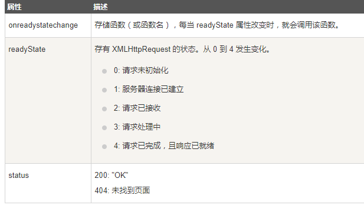

```
当 readyState等于4 且状态码 为 200时，表示响应已就绪
注意： onreadystatechange 事件被触发 4 次（0 - 4）, 分别是： 0-1、1-2、2-3、3-4，对应着 readyState 的每个变化。

服务器常用的状态码及其对应的含义如下：
200：服务器响应正常
304：该资源在上次请求之后没有任何修改（这通常用于浏览器的缓存机制，使用GET请求时尤其需要注意）
404：无法找到请求的资源
401：访问资源的权限不够
403：没有权限访问资源
404：需要访问的资源不存在
405：需要访问的资源被禁止
407：访问的资源需要代理身份验证
414：请求的URL太长
500：服务器内部错误


建立表单 
    
    表单处理时一个多线程。首先创建一个表单，以供用户输入详细的请求信息。接着输入的数据被发送到网页服务器，在服务器里这些数据得到编译和错误检测。如果PHP代码标识出一个或多个需要重要输入的字段，则带有相关错误信息的表单会重新显示。当精确的输入信息满足代码的需要时，代码会采取一些调用数据库的行为，如输入购物的细节。

    要建立一个表单，至少需要以下几个元素：一个form，一个指定GET或POST方法的提交类型、一个或多个输入字段，以及表单数据提交的目的地址 URL

<form action="http://www.w3school.com.cn/demo/welcome.php">
<span>Name:</span>
<input name="name"><br>
<span>Email:</span>
<input name="email"><br>
<input type="submit"></form>

表单处理

    PHP超全局标量 $_GET 和$_POST 用于收集表单数据 (form-data)
GET 和 POST都创建数组 （例如：array（key1=>value1, key2=>value2...）)。此数组包含键 / 值对，其中的键是表单控件的名称 （name），而值是来自用户的输入数据。

    GET 和 POST 被视作 $_GET 和 $_POST 。它们是超全局变量，这意味着对它们的访问无需考虑作用域，即无需任何特殊代码，能够从任何函数、类或文件访问它们

    $_GET 是通过 URL 参数传递到当前脚本的变量数组
    $_POST 是通过HTTP POST 传递到当前脚本的变量数组
（GET和POST的区别）
    通过 GET 方法从表单发送的信息对任何人都是可见的（所有变量名和值都显示在URL中）。GET对所发送信息的数量也有限制，限制在2048字节。不过由于变量显示在 URL 中，把页面添加到书签中也更为方便。
    注意：HTTP协议 未规定 GET 和POST 的长度限制，
             GET 的最大长度显示是因为 浏览器和 web服务器限制了 URL的长度。（因为GET方式，所有变量名和值都显示在URL中）
               不同的浏览器和 web 服务器，限制的最大长度不一样，
                所以，要支持 IE，则最大长度为 2048字节，若支持Chrome ，则最大长度 8000个字节
                
    通过POST 方法从表单发送的信息对其他人是不可见的（所有名称/值会被嵌入 HTTP 请求的主体中），并且对所发送信息的数量也无限制。此外 POST 支持高阶功能，比如向服务器上传文件时，进行 multi-part 二进制输入。不过，由于变量未显示在 URL中，也就无法将页面添加到书签。一般地，使用 POST 来发表表单数据。

一般来说，form表单如果不设置 method 属性，则默认为 GET 方法
<form method="post" action="http://www.w3school.com.cn/demo/welcome.php">

提交信息用 POST 获取信息用 GET

```

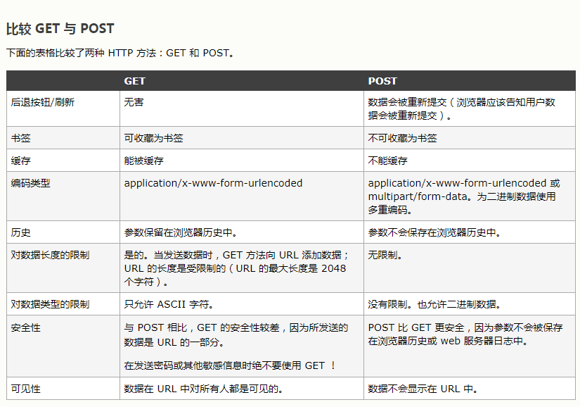


```
表单发送

    HTML网页的 <form> 元素能够以四种格式，向服务器发送数据

    使用POST方法，将enctype 属性设置为： application/x-www-form-urlencoded，这是默认方法

<form action="register.php" method="post" onsubmit="AJAXSubmit(this); return false;"></form>

    使用POST方法，将 enctype属性设置为： text/plain 

<form action="register.php" method="post" enctype="text/plain" onsubmit="AJAXSubmit(this); return false;"></form>

    使用POST方法，将 enctype属性设置为：multipart/form-data

<form action="register.php" method="post" enctype="multipart/form-data" onsubmit="AJAXSubmit(this); return false;"></form>

    使用 GET 方法， enctype 属性将被忽略

<form action="register.php" method="get" onsubmit="AJAXSubmit(this); return false;"></form>

enctype 属性规定在发送到服务器之前应该如何对表单数据进行编码。

```

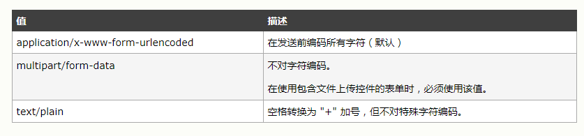

```
二、设置ajax---头部信息
        
        每个HTTP请求和响应都会带有响应的头部信息，其中有的对开发人员有用。XHR对象提供了操作头信息的方法。文本将详细介绍HTTP头目信息

        1、默认信息
        默认情况下，在发送XHR请求的同时，还会发送下列头部信息
    

Accept： 浏览器能够处理的内容类型
Accept-Charset： 浏览器能够显示的字符集
Accept-Encoding： 浏览器能够处理的压缩编码
Accept-Language： 浏览器当前设置的语言
Connection： 浏览器与服务器之间连接的类型
Cookie： 当前页面设置的任何Cookie
Host： 发送请求的页面所在的域
User-Agent： 浏览器的用户代理字符串
Referer： 发送请求的页面的URI
【注意】HTTP 规范将这个头部字段拼错了，而为保证与规范一致，也只能将错就错

        2、获取头部
        调用XHR对象的 getResponseHeader( ) 方法并传入头部字段名称，可以取得相应的响应头部信息。而调用 getAllResponseHeaders( ) 方法则可以取得一个包含所有头部信息的长字符串

var xhr;
if( window.XMLHttpRequest ){
    xhr = new XMLHttpRequest();
}else{
    xhr = new ActiveXObject('Microsoft.XMLHTTP');
}
// 异步接受响应
xhr.onreadystatechange = function(){
    if(xhr.readyState == 4){
        if(xhr.status == 200){
            /*
                     Date: Wed, 01 Mar 2017 14:00:21 GMT
                     Server: Apache/2.4.9 (Win32) PHP/5.5.12
                     Connection: Keep-Alive
                     X-Powered-By: PHP/5.5.12
                     Content-Length: 1134
                     Keep-Alive: timeout=5, max=99
                     Content-Type: text/html
                      */
            console.log(xhr.getAllResponseHeaders());
            console.log(xhr.getResponseHeader('keep-alive'))
        }else{
            alert('发生错误'：+ xhr.status)
        }
    }
}

//发送请求
xhr.open('get','test.php',true);
xhr.send()

 POST请求头
    post请求应该把数据作为请求的主体提交，而GET请求传统上不是这样。POST请求的主体可以包含非常多的数据，而且格式不限。在 xhr.open(）方法第一个参数的位置传入' POST '，金额可以初始化一个POST请求

xhr.open("post",'example",true);

 【设置请求头】
    发送POST请求的第二步就是向 send( ) 方法中传入某些数据。由于 XHR最初的设计主要是为了处理XML，因此可以在此传入 XML DOM 文档，传入的文档经序列化之后，将作为请求主体被提交到服务器。当然，也可以再次传入任何想发送给服务器的字符串。

    默认情况下，服务器对POST请求和提交Web表单的请求并不会一视同仁。因此，服务器端必须有程序来读取发送过来的原始数据，并从中解析出有用的部分。不过，可以使用XHR来模仿表单提交：
    首先将 Content-Type 头部信息设置为 application/x-www-form-urlencoded,也就是表单提交时的内容类型   

xhr.setResquestHeader("content-type","application/x-www-form-urlencoded");

如果不设置 Content-Type ，发送给服务器的数据就不会出现在 $_POST 超级全局变量中。
如果对相同的头 调用多次setRequestHeader( )，新值不会取代之前指定的值。相反，HTTP请求将包含这个头的多个副本 或 这个头将指定多个值

    【发送主体】
        接下来要以适当的格式创建一个字符串，并使用 send( ) 方法发送
    
        POST数据的格式 与 查询字符串格式相同，名和值之间用等号链接，键值对 之间 用 “&”分隔：
xhr.send('name="abc"&num=123')


```

### webSocket是否了解

```
通常情况下，面试官问你是否对XX有了解，一般的回答都是要涵盖下面这些点：
	* 
是否知道它是什么？
	* 
是否知道它的用途是什么？
	* 
它和之前某项已有的技术相比，有哪些优缺点？


webSocket和http一样，同属于应用层协议。它最重要的用途是实现了客户端与服务端之间的全双工通信，当服务端数据变化时，可以第一时间通知到客户端。
除此之外，它与http协议不同的地方还有：
	* 
http只能由客户端发起，而webSocket是双向的。
	* 
webSocket传输的数据包相对于http而言很小，很适合移动端使用
	* 
没有同源限制，可以跨域共享资源


要想了解更多详细，还是去看阮一峰的教程吧——WebSocket 教程 - 阮一峰的网络日志

```

### jQuery的ajax返回值是什么？  

```
很多公司，尤其是金融或数据分析的公司，他们的web app会与服务端进行大量的数据交互，所以他们的面试官通常会很看重面试者对于网络请求以及异步编程的理解程度。
jQuery中的ajax大家很常用，以至于绝大部分人把他认为是“理所应当”，而忽略了他的底层逻辑和实现原理。$.ajax()方法返回的是一个延迟对象，即$.Deferred的实例。
所以你可以像下面这样使用$.ajax()方法


//利用done()和fail()方法来处理ajax请求$.ajax({
url:"http://mydomain.com/memberInfo/get",
async: false}).done(responseData => {
console.log(responseData)}).fail(()=>{
console.error('出错了！')})

//$.get()也是同样的道理，除了上面延迟对象提供的方法外，还可以使用then()回调$.get("http://mydomain.com/memberInfo/get")
.then(responseData => {
console.log(responseData);
})
如果你想让这两个请求都完成后再进行处理的话，可以用下面的操作：


var memberDef = $.get("http://mydomain.com/memberInfo/get");var orderDef = $.get("http://mydomain.com/orderInfo/get");$.when(memberDef, orderDef).then(([memberInfo], [orderInfo])=>{
//这里用到了解构赋值来取得http返回的数据
console.log('用户信息',memberInfo);
console.log('订单信息',orderInfo);})
想要了解更多关于延迟对象的内容，可以访问阮一峰的博客
除了上面这一个问题，还可以追问一些下面的问题，这里就不展开解答了：
	* 
异步请求和同步请求的区别
	* 
ajax 请求有几种数据格式，如何设置数据格式
	* 
如何避免浏览器缓存get请求，以便达到每次get请求都能获取最新的数据
	* 
等等……


```

### json的原理

```
JSONP是一种跨域共享资源的方法。
很多人会好奇JSONP和JSON是什么关系，JSONP是JSON with padding的缩写，即填充式JSON或参数式JSON，是被包含在函数调用中的JSON，如下面的样子：

callback({"name": "Chong"});
JSONP是通过动态<script>元素来实现的，使用时可以为src属性指定一个跨域URL。由于浏览器加载脚本是不受同源规则限制的，所以即使是跨域的URL同样可以发送请求。因为JSONP是有效的JavaScript代码，所以再请求完成后，即在JSONP响应加载到页面中以后，就会立即执行。
示例代码：


function handleResponse(response){
alert("您的IP地址是 " + response.ip);}

var script = document.createElement("script");script.src = "http://freegeoip.net/json/?callback=handleResponse";document.body.insertBefore(script, document.body.firstChild);
所以总结一下JSONP的实现方式：
	1. 
向当前页面中动态插入一个<script>元素，src属性设置为请求地址，并在地址中指定好回调函数
	2. 
js代码中预先定义好jsonp的回调函数
	3. 
请求完成后，会立即调用预先指定好的jsonp回调，并将数据以json的格式传递到回调中。


JSONP之所以可以实现跨域，依赖的是下面的条件：
	1. 
浏览器请求脚本是不受同源规则限制的
	2. 
<script>元素加载完成的脚本会立即执行


需要注意的是，JSONP是需要服务端配合的，因为JSONP返回的是一段代码。

```

### 跨域请求资源有哪几种方式？他们的优缺点是什么 

```
常见的跨域方式如下：
	* 
JSONP
	* 
图像Ping
	* 
CORS
	* 
Web Sockets


一个一个说：
JSONP
优点：简单易用，浏览器支持好。
缺点：
	1. 
JSONP是从其他域中加载代码并执行，所以存在很多安全隐患，如果其他服务器在响应中夹带恶意代码的话，没有办法防范。
	2. 
JSONP难以确定请求失败的情况。HTML5中给<script>元素增加了一个onerror事件，但是还是有浏览器不支持。
	3. 
只能发送GET请求


图像Ping
这是指通过请求图片的方式来跨域发送请求。
优点：简单，兼容性好，不需要服务器做针对性处理。
缺点：
	1. 
只能单向通信，即客户端发送信号给服务端，无法接收到服务端的回复
	2. 
只能发送GET请求
	3. 
容易被浏览器缓存请求，导致请求发送不出去。


CORS
CORS是Cross-Origin Resource Sharing的缩写，即跨域资源共享。CORS的基本思想就是使用自定义的HTTP头部让浏览器与服务器进行沟通，从而决定请求或响应是应该成功，还是应该失败。
优点：功能强大
缺点：
	1. 
需要服务端来配合实现（其实很简单~）
	2. 
IE必须IE10以上。。。


WebSocket
这个貌似就不用多说了，属于没用过也应该听过的一种技术。
优点：
	1. 
双工通信，浏览器和服务器都可以发起请求
	2. 
通信效率高，一次链接可以复用，省去反复的握手环节


缺点：
	1. 
实现上较为复杂，包括客户端和服务端
	2. 
浏览器支持问题


还有很多其他的跨域方式，在这里就不说了

```

### XML和JSON的区别？

```
XML是标准通用标记语言 (SGML) 的子集，而标签语言（如HTML）的好处就是易懂。
优点：上手简单，非开发人员也可以快速上手（产品经理们很喜欢）。
缺点：
	1. 
XML多余的数据比较多，所以数据量大，传输时占用更多空间
	2. 
客户端和服务端解析XML都要比较繁琐，需要大量代码


JSON(JavaScript Object Notation, JS 对象标记) 是一种轻量级的数据交换格式。重点在轻上，结构与JavaScript中的Object类似。
优点：
	1. 
数据量小，利于网络传输
	2. 
方便解析，客户端和服务端都有基础的解析方法


缺点：结构稍微有点复杂，非开发人员不容易上手（初学者需要去官网学习研究一下）

```

### 下面的代码输出是什么   

```
var a = [1, 2];var b = [3, 4];console.log(a + b); //输出？

输出结果是“1,23,4”
原理：
a + b运算操作中，a和b用“+”连接，使得a和b都要先进行隐式强制类型转换，再做“加”运算。
	* 
当“+”符号两端存在一个或两个不是数字类型的值时，需要把“+”符号两端都先进行“取原始值”操作（ToPrimitive）。
	* 
a和b都是数组类型，要进行取原始值操作的话，解析器会对数组先调用valueOf()方法，如果有该方法并且返回值是原始类型的话就是这个返回值；否则继续调用toString()方法，如果返回的是原始值，则利用这个返回值进行“加”运算；否则会抛出异常
	* 
那么对于这个例子来说，[1,2]和[3,4]最终会调用toString()方法，分别返回字符串"1,2"和"3,4",再进行“加”运算后，结果就是"1,23,4"


```

### 代码 []+{} 和 {} + [] 输出的结果又什么不同？解释其原理。  

```
结果如下：
	* 
"[object Object]"
	* 
0


原理：
上面的问题涉及到JavaScript语法解析，所以不要把上面问题中的表达式以参数形式传递到console.log()或alert()方法中进行试验，那样你得到的结果会不一样。
先说[]+{}
这里会与第一题很相似，都会去取原始值，左侧的数组结果为空字符串——""，右侧的空Object的结果为字符串——"[object Object]"，那么再进行加运算的话，就是字符串拼接，最终结果为"[object Object]"
再说{}+[]
这里有些意外，因为涉及到了JavaScript的语法解析规则。在这段代码中，解析器遇到{}后将其解析为了一个空的代码块，而又将"+[]"解析为对于空数组的一元操作“+”，也就是将数组强制转换为数字，而空数组转换为数字的话就是0，那么最后结果自然就是0了。

```

### 说说什么是 显式强制类型转换 和 隐式强制类型转换？谈谈你对于二者的看法   

```
显式强制类型转换是通过显而易见的、目的明确的代码将数据进行强制类型转换，如Number()就是将变量显式的强制转换为数字类型的值。
隐式强制类型转换往往是一些操作的附带产物，如if(){}中会将括号内的部分转换为布尔类型。
而关于”显式“和”隐式“是很主观的，如果+”123“对你来说，你一眼就能看出这是将字符串”123“转换为数字的操作，那么这对于你来说就是显式的强制类型转换。

```

### 将一个变量强制转换为字符串，你能说几种方法？   

```
	* 使用String() ——String(123)
	* 
直接调用toString()方法——var a = 123;a.toString();
	* 
使用JSON.stringify()方法——JSON.stringify()
	* 
利用字符串拼接——123+”“


其中第一种最为稳妥。
第二种的缺点是，如果对象修改了自身的toString()方法的话，会影响到最终结果
第三种的缺点是，缺点还是很多的……，如果传入的参数本身就是字符串的话，返回的结果是带双引号的，如下面：

JSON.stringify("123"); //""123""
如果传入的是Object还要确保没有递归引用，否则会抛出异常，如下面


var a = {},b = {};a.param = b;b.param = a;JSON.string(a);
//Uncaught TypeError: Converting circular structure to JSON
MDN还给出了下面的注意提醒：
关于序列化，有下面五点注意事项：
	* 
非数组对象的属性不能保证以特定的顺序出现在序列化后的字符串中。
	* 
布尔值、数字、字符串的包装对象在序列化过程中会自动转换成对应的原始值。
	* 
undefined、任意的函数以及 symbol 值，在序列化过程中会被忽略（出现在非数组对象的属性值中时）或者被转换成 null（出现在数组中时）。
	* 
所有以 symbol 为属性键的属性都会被完全忽略掉，即便 replacer 参数中强制指定包含了它们。
	* 
不可枚举的属性会被忽略


第四种的缺点是，表面上看上去应该和第一种String()是一样的，但是其实还是有些差距的，下一题咱们再讨论。

```

### 通常的两种转字符串的方法： String(a) 和 a+""。他们之间是否存在差异？

```
两者看上去都是将变量转换为字符串，但是还是有个细微差别的。
看下面的例子：


var a = {
valueOf: ()=>"123",
toString: ()=>"456"}String(a); //"456"a + ""; //"123"
通过现象可以看得出来，String()是直接调用了a的toString()方法，而a+""则是先调用了valueOf()方法。原因是加运算是隐式强制类型转换，会对两端操作数进行ToPrimitive操作，前面已经说过，这里不再赘述。
这里有个经典的例子，就是在ES6下对于Symbol类型值进行字符串转换时。

var a = Symbol('first');String(a); //"Symbol(first)"a + ""; //Uncaught TypeError: Cannot convert a Symbol value to a string

```

### 有哪些值强制转换成布尔类型时结果为false？  

```
此题必考！
	* 
undefined
	* 
null
	* 
-0
	* 
+0
	* 
NaN
	* 
false
	* 
""


此外还有一种是假值对象，注意下面的代码（在Chrome中运行）

document.all; //输出当前文档下的所有标签Object.prototype.toString.call(document.all); //[object HTMLAllCollection]Boolean(document.all); //false,意外吧？！！！

```

### 宽松相等——“==”和严格相等——“===”有什么区别？ 

```
很多人会说——“==检查值是否相等，===检查值和类型是否相等”，
正解应该是——“==允许在相等比较中进行强制类型转换，而===不允许”。
```

### 下面的代码输出是什么？解释其原理。 

```
a = "666";var b = true;console.log(a == b); //输出?
结果输出false
还是会有一部分人会犯这个错误的，因为下面的代码我们经常会使用：


if("666"){
console.log("代码会运行到这里");}
大家觉得"666"转换为布尔类型应该是true啊，所以上面的a==b应该是true。但其实并不是这样，关于宽松相等==来说逻辑十分复杂且晦涩难懂，难以记忆。
这里我觉得答出是 false就可以了，因为有下面这个公式要记忆

```

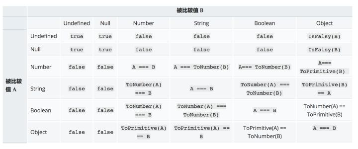

```
MDN对于宽松相等的表格总结
可以看出，==两端是布尔类型和字符串类型的时候，会对两端都进行ToNumber操作，也就是"666"被转换为数字666，而true被传唤为1，所以最终结果自然为false。
说到这里，既然宽松相等的强制类型转换这么晦涩难懂而且不好记忆，那么我们应该怎么办？
给大家几个建议：
	* 
如果==两端有true或false，那么千万不要使用==
	* 
如果==两端的值中有[]、""、或者0，尽量不要使用==
```

### 什么样的处理可以使得下面的代码输出为true？   

```
var s;/**** * 一些处理****/console.log(s == 5 && s == 6); //true，上面代码对s做了什么处理？
实际上我的处理是这样的（此题是我在《你不知道的JavaScript中卷》中看到的）：


var s;var i = 5;s = {
valueOf: ()=>i++};console.log(s == 5 && s == 6); //此时输出的结果就是true
此例重点是想提醒大家，每次的类型转换都会调用变量的valueOf()方法，应该尽量知道自己在做什么，才可以做类似这样的比较操作。

```

### 将一个变量强制转换为数字类型时，都进行了哪些操作？  

```
将变量强制转换为数字遵循的是ToNumber操作。
对于基本类型的话：
true → 1
false → 0
undefined → NaN
null → 0
对于字符串，遵循常量的相关规则语法，如果转化失败就返回NaN
对于对象来说：
会先进行去原始值操作ToPrimitive，即先检查该值是否有valueOf()方法，如果有并且返回的基本类型值，就使用该值进行转强制类型转换。如果不是就使用toString()的返回值进行强制类型转换。如果valueOf()和toString()均不返回基本类型值，会产生TypeError错误。

```

### js运行机制详解

```
阮一峰：http://www.ruanyifeng.com/blog/2014/10/event-loop.html

https://blog.csdn.net/liaodehong/article/details/50488098

```

### JavaScript中的数据类型都有哪些？

```
数据类型有两种：原始数据类型（又称基础数据类型、可变数据类型）和复杂数据类型（又称对象、不可变数据类型）。
原始数据类型包括：undefined，null，数字，字符串，布尔类型，Symbol（ES6 新加入的类型）
复杂数据类型包括：包括对象
其中对象包括：内部对象（Array、String等），宿主对象（window）和自定义对象。

```

### 如何判断一个变量是否为数组？   

```
数据类型有两种：原始数据类型（又称基础数据类型、可变数据类型）和复杂数据类型（又称对象、不可变数据类型）。
原始数据类型包括：undefined，null，数字，字符串，布尔类型，Symbol（ES6 新加入的类型）
复杂数据类型包括：包括对象
其中对象包括：内部对象（Array、String等），宿主对象（window）和自定义对象。
```

### 如何判断一个变量是否为数组？   

```
如果是ES5环境的话，可以用Array.isArray()方法。
如果不确定运行环境的话，可以用Object.prototype.toString.call()的方法来确认，如果结果是[object Array]则认为数组。

```

### undefined和null的相同与不同？ 

```
相同点：
	1. 
这两个数据类型都只有一个值
	2. 
都没有方法
	3. 
都表示“无”
	4. 
转化为布尔类型时，都是false


不同点：
	1. 
null是一个关键字，而undefined不是一个关键字。所以，var undefined = 1 ;//这是可以的，虽然这里undefined的值是不会改变的。var null = 1;//这样是报错的。
	2. 
null的实质是一个空的对象，而undefined是window的一个属性。
	3. 
进行数字类型转换时，null返回0，undefined返回NaN


```

### 隐式类型转化的时候，JavaScript底层都做了哪些处理？ 

```
对象转成原始数据类型时，先调用对象的valueOf方法，如果返回结果不是原始数据类型的值，再调用toString方法。
原始类型之间转换时，
原始类型转原始类型时，直接调用对应的构造函数进行转换
```

### 有哪些值转化成布尔型后为false？   

```
包括下面这个六种：
0、-0、undefined、null、空字符串、NaN
```

### 讲讲ES6中的Symbol？  

```
Symbol是ES6中新加的一个原始类型，他的每个值都是唯一的，即使是用两个完全一样的变量构造出来的Symbol也不相等。
原始类型传入Symbol方法时，会进行转换成字符串 再转成Symbol类型值；如果是对象的话，会先调用改对象的toString方法再转成Symbol类型的值。
Symbol是最大的用处是用来消除“魔法字符串”的。
```

### 如何把字符串转换为数组？   

```
可以利用字符串的join方法，也可以用下面的一题中的方法。
```

### 如何把类数组的变量转化为数组？   

```
是如果是ES6，可以用Array.from()方法。
如果不确定环境的话，可以用Array.prototype.slice.call()的方法，将类似数组转换为。
Array.from()的详解：
Set类型的转换


let s = new Set(['foo', window]);
Array.from(s);
// ["foo", window]
Map类型的转换


let m = new Map([[1, 2], [2, 4], [4, 8]]);Array.from(m);
// [[1, 2], [2, 4], [4, 8]]
类数组的值


function f() {
return Array.from(arguments);}

f(1, 2, 3);

// [1, 2, 3]
Array.from()的第二个参数mapFn也很有用处，可以对于传入的类数组值进行定制化修改

// Using an arrow function as the map function to// manipulate the elementsArray.from([1, 2, 3], x => x + x);
// [2, 4, 6]


// Generate a sequence of numbers// Since the array is initialized with `undefined` on each position,// the value of `v` below will be `undefined`Array.from({length: 5}, (v, i) => i);// [0, 1, 2, 3, 4]

```

### 常用的客户端存储方法有哪些？   

```
平时前端开发中用到最多的是cookie、sessionStorage、localStorage，也有少量的业务场景会使用indexedDB。
```

### cookie、sessionStorage和localStorage的区别   

```
（敲黑板啦，这题必考）
很多博客上会提到此题，但是一般说的都很浅。我觉得可以从以下几个方面说：
存储时效来说：
	* 
cookie可以手动设置失效期，默认为会话级
	* 
sessionStorage的存储时长是会话级
	* 
localStorage的存储时长是永久，除非用户手动利用浏览器的工具删除


访问的局限性：
	* 
cookie可以设置路径path，所有他要比另外两个多了一层访问限制
	* 
localStorage和sessionStorage的访问限制是文档源级别，即协议、主机名和端口
	* 
还要注意的是，cookie可以通过设置domain属性值，可以不同二级域名下共享cookie，而Storage不可以，比如http://image.baidu.com的cookie http://map.baidu.com是可以访问的，前提是Cookie的domain设置为".http://baidu.com"，而Storage是不可以的（这个很容易实验，就不细说了）


存储大小限制：
	* 
cookie适合存储少量数据，他的大小限制是个数进行限制，每个浏览器的限制数量不同
	* 
Storage的可以存储数据的量较大，此外他是通过占用空间大小来做限制的，每个浏览器的实现也是不同的，大家可以看这篇文章来进一进步了解Web Storage Support Test


操作方法：
	* 
cookie是作为document的属性存在，并没有提供标准的方法来直接操作cookie
	* 
Storage提供了setItem()和getItem()还有removeItem()方法，操作方便不易出错


其他：
	* 
cookie在发送http请求时，会将本地的cookie作为http头部信息传递给服务器
	* 
cookie可以由服务器通过http来设定


```

### cookie由哪些部分组成？   

```
大家一般都是用已有的库来操作cookie，很少有人利用原生方法直接操作cookie，所以cookie究竟由哪些部分也会被人忽视。
除了基础的键值对外，cookie还有下面的属性：
Expires ：cookie最长有效期
Max-Age：在 cookie 失效之前需要经过的秒数。（当Expires和Max-Age同时存在时，文档中给出的是已Max-Age为准，可是我自己用Chrome实验的结果是取二者中最长有效期的值）
Domain：指定 cookie 可以送达的主机名。
Path：指定一个 URL 路径，这个路径必须出现在要请求的资源的路径中才可以发送 Cookie 首部
Secure：一个带有安全属性的 cookie 只有在请求使用SSL和HTTPS协议的时候才会被发送到服务器。
HttpOnly:设置了 HttpOnly 属性的 cookie 不能使用 JavaScript 经由 Document.cookie 属性、XMLHttpRequest 和 Request APIs 进行访问，以防范跨站脚本攻击（XSS）。

```

### 如何用原生JS方法来操作cookie   

```
上面已经说过了，在浏览器中cookie做为document的一个属性存在，并没有提供原生的操作方法，并且所有形式都以字符串拼接的形式存储，需要开发利用字符串操作的方法来操作document.cookie，从而达到操作客户端cookie的目的。
想操作cookie，必须知道document.cookie中存储的字符串是怎样的结构。
document.cookie返回的结构大概如下面的样子：

name1=value1; name2=value2; name1=value3
即：document.cookie返回当前页面可用的（根据cookie的域、路径、失效时间和安全设置）所有cookie的字符串，一系列由分号隔开的名值对儿。

当想设置cookie时，可以直接对document.cookie赋值，对document.cookie赋值并不会覆盖掉cookie，除非设置的cookie已经存在。设置cookie的格式如下，和Set-Cookie头中的使用的格式是一样的。


name=value; expires=expiration_time; path=domain_path; domain=domain_name; secure
上面这些参数中，只有cookie中的名字和值是必须的。下面是一个简单的例子：

document.cookie = 'name=Roy';

此外，需要注意的是设置值时需要对于属性和值都用encodeURIComponent()来保证它不包含任何逗号、分号或空格(cookie值中禁止使用这些值).

```

### 在Hybrid环境下（混合应用），使用客户端存储应该注意哪些？   

```
在混合应用中，主要是注意会话级存储——sessionStorage。
因为混合应用中的webview从一个页面跳转的另一个页面时，会话并没有像浏览器中那样是继承延续的，也就是说，当在A页面中设置的了sessionStorage值后跳转的下一个页面时，这是sessionStorage是全新的，根本获取不到A页面中设置的任何sessionStorage。
所以如果你们的app开发者还没有解决这个问题的话，建议这时使用session级别的cookie来代替sessionStorage，因为cookie是可以跨标签访问的，不要会话连续。

```

### sessionStorage和localStorage存储的数据类型是什么？   

```
sessionStorage和localStorage只能存储字符串类型的数据，如果setItem()方法传入的数据不是字符串的话，会自动转换为字符串类型再进行存储。所以在存储之前应该使用JSON.stringfy()方法先进行一步安全转换字符串，取值时再用JSON.parse()方法再转换一次。

```

### session级存储中，session cookie和sessionStorage有哪些区别？   

```
详细的分析可以看 ： https://zhuanlan.zhihu.com/p/31404516
大体的概括就是说：
	* 
sessionStorage的会话基于标签，即标签关闭则会话终止，而cookie基于浏览器进程。
	* 
sessionStorage的访问必须基于会话继承和延续，即只有在当前标签下或当前标签打开的标签下可以访问sessionStorage中的数据，而cookie是可以跨标签进行访问的。


```

### 如何判断一个变量是否为NaN？  

```
相信大多数人应该都会想到这个不就用运行环境提供的内建方法 isNaN()来判断吗？
如下面的代码：


isNaN(1); //falseisNaN("666"); //false, 恩，字符串666确实不是NaNisNaN(5*"abc"); //true,恩，5*字符串abc得到的结果确实是NaN

isNaN('what?'); //true， 啊？!! 这不并不是我想要的
事实上，isNaN的逻辑是“输入参数是否不是NaN，也不是数字”。这句话是在《你不知道的JavaScript（中卷）》 2.4.3中提到的，我理解isNaN()的逻辑可以理解为“输入参数是否可以转化为数字”更加贴切和容易理解。所以字符串“666”的返回值为false，因为他可以转化为数字，而字符串“what？”不能转换为数字，故返回值为false。
那既然无法用isNaN来检测一个值是否为NaN，那么该如何做？
有两种办法
第一种，根据上面的实验，我们可以先判断输入参数的类型是否为number，再调用isNaN方法，这样就避免了对于非数字类型的判断错误。代码如下：


if(!Number.isNaN){
Number.isNaN = function(n){
return (
typeof n === 'number' && window.isNaN(n)
)
}}

Number.isNaN(5*'abc'); //trueNumber.isNaN('what?'); //false
第二种，利用NaN的一个特性，它是JS语言中唯一一个不等于他本身的值，所以我们也可以这么写。


if(!Number.isNaN){
Number.isNaN = function(n){
return n !== n;
}}

Number.isNaN(5*'abc'); //trueNumber.isNaN('what?'); //false
还有一种，可以利用ES6中提供的Object.is()方法来进行验证

Object.is(5*'abc', NaN); //trueObject.is('what?', NaN); //false

如果你的代码中仍然使用isNaN()，那么你的程序迟早会出现bug。

```

### 如何判断两个浮点数相等？ 

```
在JavaScript中，0.1+0.2 不等于0.3是一个经典问题，他时刻提醒你，对于浮点数来说，他并不能像普通数学题那样简单比较。究其原因，是因为在JS中，0.1+0.2的值是一个比较接近0.30000000000000004的数字，所以他并不等于0.3。
不要小看这个问题，浮点数的运算经常会出现，比如计算商品的折扣、计算税费等情况下都需要对浮点数进行运算。
通常的做法是设置一个误差范围值，通常称为“机器密度”，对于JavaScript来说，这个值是2的-52次幂，即Math.pow(2, -52)。
所以，可以对于浮点数进行比较时可以用下面的方法(在ES6中，Number.EPSILON是自带的)，以下代码示例来源于《你不知道的JavaScript（中卷）》2.3.2


if(!Number.EPSILON){
Number.EPSILON = Math.pow(2, -52);}

function numbersCloseEnoughToEqual(n1, n2){
return Math.abs(n1 - n2) < Number.EPSILON;}

numbersCloseEnoughToEqual(0.1+0.2, 0.3); //true
此外，需要说明的是JavaScript中最大的浮点数是Number.MAX_VALUE和Number.MIN_VALUE。

```

### 如何检测一个值是否整数 

```
如果允许使用ES6的话，可以用Number.isInterger()；这个方法干净利落。

Number.isInterger(1.000); //trueNumber.isInterger(1); //trueNumber.isInterger('1'); //false
如果不允许使用ES6的话，可以自行写一个pollyFill方法。


if(!Number.isInterger){
Number.isInterger = function(num){
return (typeof num === 'number') && num%1 === 0;
}}

```

### 对于一个数字进行取整，你能说出多少种方法？   

```
parseInt()这个方法你肯定能想到。但你可能想不到他的坑还真不少，未必是无懈可击的方法。
在最后一个问题中，我在详细解答。
其实还有很多很简单有效的方法来对数字进行取整。
比如下面的方法：

8.84|0; //8~~8.84; //88.84>>0; //8
这三种方法都是可以的，分别说一下：
8.84|0或者 写成0 | 8.84 都是一样的，从语法上看，他是让0与指定值进行按位“或”运算，在JavaScript中，它先对指定值执行了ToInt32的转换，在按位进行或运算，所以最终结果就是把指定值转换为32位的整数。
而~~8.84也是对变量进行ToInt32的转换；再进行一步按位“取非”运算，即对每个字节进行反转；然后，再对结果再次“取非”。
那么8.84>>0的操作就同理可证了……

但是，上面的三种方法也是有其局限性的，因为他们是遵循ToInt32的转化规范，所以他们也只能对于32位的数字进行转换，所以再加上一个符号位，那么他们所能处理的数字范围在2的正负31次幂之间，即-2147483648 ≤ x ≤ 2147483647。
```

### 当一个变量显式类型转换时（利用Number()方法），遵循的规则是什么？ 

```
这个问题应该会有很多种文法，比如，把一个字符串转换为数字时，都经历了哪些操作？
这道题还是很考验基础的，一般工程师是不会记住这个细节点的。
言归正传，ES5规范中规定了这个抽象操作ToNumber。
对于布尔型：true的结果为1，false的结果为0；
对于undefined： 结果为NaN
对于null：结果为0
对于字符串类型：遵循数字常量的相关规则和语法。处理失败时会返回NaN。
对于复杂类型：会先调用该值得valueOf()方法，如果有并且返回基本类型之，就是用该值进行强制类型转换。如果没有就是使用toString()的返回来进行强制类型转换。
举个例子来加强一下记忆：
var test1 = {
valueOf: function(){
return 10; //valueOf方法的将被调用；
},
toString: function(){
return 666;
}}

Number(test1) ; //102*test1; //20


Number(test2); //666Number(test2)/2; //333

```

###  Number([])和Number([1,2,3])的值分别是什么？说明其原理？   

```
这道题应该也算是上一道题的加强记忆了。
大家已经知道了是先调用valueOf()，再调用toString()方法，那么空数组和[1,2,3]有什么区别呢？
因为数字的valueOf()方法返回的是数组本身，不是一个基本类型，所以还会调用toString()方法；而数组的toString()方法返回的是数组各项通过逗号拼接一起的字符串（可以理解调用了Array.prototype.join(",")方法），所以空数组返回空字符串，转换为数组自然就是0；而数组[1,2,3]则只能转换为NaN了.
那么，大家觉得下面的代码应该输出什么呢？为什么？
Number([100]); //???
```

### 讲一讲parseInt()方法遵循的运算规则？   

```
之前已经提到了，parseInt()方法含有太多坑。也许面试者会问你下面的代码为什么可以输出52

parseInt('52px'); //52
如果想回答上面的问题，你必须知道下面的知识点。
parseInt(string, radix);方法的接受两个参数：
	* 
string：


要被解析的值。如果参数不是一个字符串，则将其转换为字符串(使用 ToString 抽象操作)。字符串开头的空白符将会被忽略。
	* 
radix：


一个介于2和36之间的整数(数学系统的基础)，表示上述字符串的基数。比如参数"10"表示使用我们通常使用的十进制数值系统。始终指定此参数可以消除阅读该代码时的困惑并且保证转换结果可预测。当未指定基数时，不同的实现会产生不同的结果，通常将值默认为10。

返回值：
返回解析后的整数值。 如果被解析参数的第一个字符无法被转化成数值类型，则返回 NaN。
如果 parseInt 遇到了不属于radix参数所指定的基数中的字符那么该字符和其后的字符都将被忽略。接着返回已经解析的整数部分。

所以，这里就明白为什么字符串'52px'会被parseInt()解析为52，因为没有传递第二个参数radix，所以默认按照10进制进行解析，而字符'p'不在10进制内，所以字符'p'和后面的字符全部被忽略，直接返回数字52.

下面是parseInt()最经典的一个坑：

parseInt(1/0, 19); //18
如果不亲自一试，你绝不会相信上面代码的输出是18。
这里需要知道的是，1/0运算结果是“无穷”，在JavaScript中为Infinity，而这个Infinity转换为字符串则为'Infinity'，第一个字符是'I'，在以19为基数时他的值为18。第二个字符‘n’不是一个有效的数字字符，所以除第一个字符外，后面的字符全部被忽略，所以最后就返回了18。

```

### Date的构造函数接受哪几种形式的参数？   

```
这道题看上去是一个“背书题”，貌似记住了书中的内容就可以答上此题，但是其实Date对象的构造函数的参数还是好几种形式的，这点很容易让人忽略。
Date对象的构造函数接受下面的几种形式的参数：
包括默认参数——空、时间戳（距离1970年1月1日标准时间的毫秒长度）、和以具体时间点为组合的参数
new Date();new Date(value);new Date(dateString);new Date(year, month[, day[, hour[, minutes[, seconds[, milliseconds]]]]]);
也就是说下面的代码都可以实例化一个Date对象
var today = new Date();var today = new Date(1453094034000); // by timestamp(accurate to the millimeter)var birthday = new Date('December 17, 1995 03:24:00');var birthday = new Date('1995-12-17T03:24:00');var birthday = new Date(1995, 11, 17);var birthday = new Date(1995, 11, 17, 3, 24, 0);

var unixTimestamp = Date.now(); // in milliseconds
需要注意的是在Safari和Chrome中，对于dateString的构造方式还是有些不同的，如下面这个时间字符串在Chrome中是可以解析的，而在Safari中将抛出异常。
new Date('2017-10-14 08:00:00')//在Chrome中正常工作，而Safari中抛出异常Invalid Date

new Date('2017/10/14 08:00:00');new Date('2017-10-14');//上面这两种构造方式都在两个浏览器都是可以正常运行的，说明Chrome的检查范围更宽泛


```

### 如何优雅的输出“今天星期几”？   

```
这个题详细对于Date对象稍加了解的人都能答上，但是想要将代码写的真正简明扼要却很考验开发者的功力。
如果你要是回答利用Date对象实例的getDay()方法，然后再通过if或switch等流程控制语句来拼接字符串的话，那确实有点low了。
优雅的方式是：

'今天星期'+'日一二三四五六'.charAt(new Date().getDay())


```

### 如何将Date对象输出为指定格式的字符串，如(new Date(), 'YYYY.MM.DD') => '2017.10.16' 

```
这道题被问到的可能性还是很高的（阿里前端的面试就问了一次）
思路就是将预先想定的格式字符串通过replace方法替换成对应的时间片段，如将YYYY替换成Date.prototype.getFullYears()的输出，当然每种形式还有不同的替换规则，但是思路大致相同。
下面是一个比较稳健的替换方式。


function formatDate(date, format) {
if (arguments.length < 2 && !date.getTime) {
format = date;
date = new Date();
}
typeof format != 'string' && (format = 'YYYY年MM月DD日 hh时mm分ss秒');
var week = ['Sunday', 'Monday', 'Tuesday', 'Wednesday', 'Thursday', 'Friday', 'Saturday', '日', '一', '二', '三', '四', '五', '六'];
return format.replace(/YYYY|YY|MM|DD|hh|mm|ss|星期|周|www|week/g, function(a) {
switch (a) {
case "YYYY": return date.getFullYear();
case "YY": return (date.getFullYear()+"").slice(2);
case "MM": return (date.getMonth() + 1 < 10) ? "0"+ (date.getMonth() + 1) : date.getMonth() + 1;
case "DD": return (date.getDate() < 10) ? "0"+ date.getDate() : date.getDate();
case "hh": return (date.getHours() < 10) ? "0"+ date.getHours() : date.getHours();
case "mm": return (date.getMinutes() < 10) ? "0"+ date.getMinutes() : date.getMinutes();
case "ss": return (date.getSeconds() < 10) ? "0"+ date.getSeconds() : date.getSeconds();
case "星期": return "星期" + week[date.getDay() + 7];
case "周": return "周" + week[date.getDay() + 7];
case "week": return week[date.getDay()];
case "www": return week[date.getDay()].slice(0,3);
}
});};
```

### 如何计算两个时间点的时间差 

```
是这里可以参考掘金的一篇文章js 计算两个时间的时间差 - 掘金，这篇讲的比较详细，但是真正在面试的时候要说这么细的话估计面试官也没有耐心听。
简单的概括的话，就是先取得这两个时间点的时间戳（距离1970年一月一日的标准日期的毫秒数），通过毫秒数和取余的方式来顺序取得天数、小时数、分数。

```

### 如何获取几天后的时间点对应的时间对象？   

```
这道题是不是太简单了？~
这需要在当前时间戳上加上(天数×24×60×60×1000)这么多毫秒数即可。
此外向大家推荐一个不错的开源项目 ——MomentJS Moment.js | Home
上面几道题都有封装好的且设计优雅的方法，感兴趣的可以去围观一下。

```

### 如何判断一个变量是否为数组？   

```
本题在上一章中——《关于数据类型的前端面试题》已经做了一个简单的解答，这里再展开一下。
为什么不用typeof？

var list = [1,2,3];typeof list //"object"
Array继承与Object，所以typeof 会直接返回object，所以不可以用typeof方法来检测
为什么不用instanceof?

var list = [1,2,3];list instanceof Array //true
instanceof 表面上看确实是返回了true，但其实并不可靠。原因是Array实质是一个引用，用instanceof方法（包括下面的constructor方法）都是利用和引用地址进行比较的方法来确定的，但是在frame嵌套的情况下，每一个Array的引用地址都是不同的，比较起来结果也是不确定的，所以这种方法有其局限性。
为什么不用constructor方法？

var list = [1,2,3];list.constructor === Array; //true
原因已经解释过了，不再赘述。
可靠的检测数组方式
1.利用Object的toString方法

var list = [1,2,3];Object.prototype.toString.call(list); //[object Array]
2.利用ES6的Array.isArray()方法

var list = [1,2,3];Array.isArray(list); //true
数组的原生方法有哪些？
这道题真心会是一道必问题，看似简单，但其实考察的内容还是很多的。
一是考察面试者平时使用的是否足够平凡；二是观察面试者是否对于日常的知识有所归纳
建议回答者可以根据自己的平时归纳的手法来回答，如果你没有归纳总结，而是用到哪个方法临时去w3school上或MDN上查的话，那正是面试官不希望见到的情况。

可以用MDN中给出的方式来回答：
会改变自身的方法
Array.prototype.copyWithin() 在数组内部，将一段元素序列拷贝到另一段元素序列上，覆盖原有的值。
Array.prototype.fill() 将数组中指定区间的所有元素的值，都替换成某个固定的值。
Array.prototype.pop()删除数组的最后一个元素，并返回这个元素。
Array.prototype.push()在数组的末尾增加一个或多个元素，并返回数组的新长度。
Array.prototype.reverse()颠倒数组中元素的排列顺序，即原先的第一个变为最后一个，原先的最后一个变为第一个。
Array.prototype.shift()删除数组的第一个元素，并返回这个元素。
Array.prototype.sort()对数组元素进行排序，并返回当前数组。
Array.prototype.splice()在任意的位置给数组添加或删除任意个元素。
Array.prototype.unshift()在数组的开头增加一个或多个元素，并返回数组的新长度。

不会改变自身的方法
Array.prototype.concat()返回一个由当前数组和其它若干个数组或者若干个非数组值组合而成的新数组。
Array.prototype.includes() 判断当前数组是否包含某指定的值，如果是返回 true，否则返回 false。
Array.prototype.join()连接所有数组元素组成一个字符串。
Array.prototype.slice()抽取当前数组中的一段元素组合成一个新数组。
Array.prototype.toSource() 返回一个表示当前数组字面量的字符串。遮蔽了原型链上的 Object.prototype.toSource() 方法。
Array.prototype.toString()返回一个由所有数组元素组合而成的字符串。遮蔽了原型链上的 Object.prototype.toString() 方法。
Array.prototype.toLocaleString()返回一个由所有数组元素组合而成的本地化后的字符串。遮蔽了原型链上的 Object.prototype.toLocaleString() 方法。
Array.prototype.indexOf()返回数组中第一个与指定值相等的元素的索引，如果找不到这样的元素，则返回 -1。
Array.prototype.lastIndexOf()返回数组中最后一个（从右边数第一个）与指定值相等的元素的索引，如果找不到这样的元素，则返回 -1。

遍历方法
Array.prototype.forEach()为数组中的每个元素执行一次回调函数。
Array.prototype.entries() 返回一个数组迭代器对象，该迭代器会包含所有数组元素的键值对。
Array.prototype.every()如果数组中的每个元素都满足测试函数，则返回 true，否则返回 false。
Array.prototype.some()如果数组中至少有一个元素满足测试函数，则返回 true，否则返回 false。
Array.prototype.filter()将所有在过滤函数中返回 true 的数组元素放进一个新数组中并返回。
Array.prototype.find() 找到第一个满足测试函数的元素并返回那个元素的值，如果找不到，则返回 undefined。
Array.prototype.findIndex() 找到第一个满足测试函数的元素并返回那个元素的索引，如果找不到，则返回 -1。
Array.prototype.keys() 返回一个数组迭代器对象，该迭代器会包含所有数组元素的键。
Array.prototype.map()返回一个由回调函数的返回值组成的新数组。
Array.prototype.reduce()从左到右为每个数组元素执行一次回调函数，并把上次回调函数的返回值放在一个暂存器中传给下次回调函数，并返回最后一次回调函数的返回值。
Array.prototype.reduceRight()从右到左为每个数组元素执行一次回调函数，并把上次回调函数的返回值放在一个暂存器中传给下次回调函数，并返回最后一次回调函数的返回值。
Array.prototype.values() 返回一个数组迭代器对象，该迭代器会包含所有数组元素的值。
Array.prototype[@@iterator]() 和上面的 values() 方法是同一个函数。

```

### 如何将类数组的变量转化为数组？   

```
这道题在上章也提到了，这里再写一篇。
是如果是ES6，可以用Array.from()方法。
如果不确定环境的话，可以用Array.prototype.slice.call()的方法，将类似数组转换为。
Array.from()的详解：
Set类型的转换


let s = new Set(['foo', window]);
Array.from(s);
// ["foo", window]
Map类型的转换


let m = new Map([[1, 2], [2, 4], [4, 8]]);Array.from(m);
// [[1, 2], [2, 4], [4, 8]]
类数组的值


function f() {
return Array.from(arguments);}

f(1, 2, 3);

// [1, 2, 3]
Array.from()的第二个参数mapFn也很有用处，可以对于传入的类数组值进行定制化修改


// Using an arrow function as the map function to// manipulate the elementsArray.from([1, 2, 3], x => x + x);
// [2, 4, 6]


// Generate a sequence of numbers// Since the array is initialized with `undefined` on each position,// the value of `v` below will be `undefined`Array.from({length: 5}, (v, i) => i);// [0, 1, 2, 3, 4]

```

### 说一说ES6对于数组的扩展   

```
增加了扩展运算符（spread）...
它将一个数组转化为以逗号分隔的一个参数序列。

var list = [1,2,3];console.log(...list); //1 2 3
增加了两个方法，Array.from()和Array.of()方法。
增加了一些实例方法，如copyWithin()、entries（）、keys()、values（）等。
```

### 数组去重，你能说出多少种方法？   

```
1.利用一个空Object来实现


Array.prototype.unique = function(){
var tmp = {},res=[];
this.forEach(function(i){
!tmp[i] && res.push(i) && (tmp[i] = true);
})
return res;}var list = [0,0,1,2,3,6,6];console.log(list.unique()); //[0,1,2,3,6]
2.利用ES6 的Set数据结构

console.log([...new Set(list)]); //[0,1,2,3,6]

```

### 你知道Array.prototype的类型是什么吗？   

```
很多人都不知道，其实Array.prototype是一个数组，只不过length为0
```

###  如何“打平”一个嵌套数组，如[1,[2,[3]],4,[5]] => [1,2,3,4,5]?你能说出多少种方法？   

```
这个方法很多，如果你的答案是用递归的话，那确实有点low，而且代码会比较复杂。
我的觉得可以用以下方法来解决这个问题：
1.利用Array.prototype.toString()方法

var list = [1,[2,[3]],4,[5]];console.log(list.toString()); //1,2,3,4,5
原理：toString 方法返回一个字符串，该字符串由数组中的每个元素的 toString() 返回值经调用 join() 方法连接（由逗号隔开）组成。
2.利用Array.prototype.join()方法

var list = [1,[2,[3]],4,[5]];console.log(list.join()); //1,2,3,4,5
原理：join方法会让所有的数组元素转换成字符串，再用一个分隔符将这些字符串连接起来。如果元素是undefined 或者null， 则会转化成空字符串。
PS:如果你觉得上面输出的不是一个数组，可以稍微加工一下

var list = [1,2,3,4,5];JSON.parse(`[${list.toString()}]`); //[1,2,3,4,5]JSON.parse(`[${list.join()}]`); //[1,2,3,4,5]


```

### 如何克隆一个数组？你能说出多少种？   

```
1.借用concat方法
var arr1 = [1,2,3];var arr2 = arr1.concat();
2.借用slice方法
var arr1 = [1,2,3];var arr2 = arr1.slice(0);
原理：数组本质上也是Object，直接赋值的话，只是将引用赋值给另一个变量，最终会导致被复制的变量也会随着原来的数组变化而变化。
```

### 说一说Array.prototype.sort()方法的原理？（追问：不传递参数会如何？）   

```
语法
sort方法接受一个“比较函数”作为参数。
如果调用该方法时没有使用参数，将按字母顺序对数组中的元素进行排序，说得更精确点，是按照字符编码的顺序进行排序。要实现这一点，首先应把数组的元素都转换成字符串（如有必要），以便进行比较。

如果想按照其他标准进行排序，就需要提供比较函数，该函数要比较两个值，然后返回一个用于说明这两个值的相对顺序的数字。比较函数应该具有两个参数 a 和 b，其返回值如下：
若 a 小于 b，在排序后的数组中 a 应该出现在 b 之前，则返回一个小于 0 的值。
若 a 等于 b，则返回 0。
若 a 大于 b，则返回一个大于 0 的值。

```

### 找出Array中的最大元素，你能说出几种方法？   

```
1.自己实现一个冒泡算法，实现就不多说了
2.利用Math的max方法

var list = [1,100,23,65,43,2,9];Math.max.apply(null, list); //[1, 2, 9, 23, 43, 65, 100]
3.利用Array的sort方法先排序再取值

var list = [1,100,23,65,43,2,9];list.sort((a, b) => {return a-b;}) //[1, 2, 9, 23, 43, 65, 100]

```

### position的值， relative和absolute分别是相对于谁进行定位的？  

```
	* absolute :生成绝对定位的元素， 相对于最近一级的 定位不是 static 的父元素来进行定位。
	* 
fixed （老IE不支持）生成绝对定位的元素，通常相对于浏览器窗口或 frame 进行定位。
	* 
relative 生成相对定位的元素，相对于其在普通流中的位置进行定位。
	* 
static 默认值。没有定位，元素出现在正常的流中
	* 
sticky 生成粘性定位的元素，容器的位置根据正常文档流计算得出
```

### 如何解决跨域问题   

```
JSONP：
原理是：动态插入script标签，通过script标签引入一个js文件，这个js文件载入成功后会执行我们在url参数中指定的函数，并且会把我们需要的json数据作为参数传入。
由于同源策略的限制，XmlHttpRequest只允许请求当前源（域名、协议、端口）的资源，为了实现跨域请求，可以通过script标签实现跨域请求，然后在服务端输出JSON数据并执行回调函数，从而解决了跨域的数据请求。
优点是兼容性好，简单易用，支持浏览器与服务器双向通信。缺点是只支持GET请求。
JSONP：json+padding（内填充），顾名思义，就是把JSON填充到一个盒子里


<script>
function createJs(sUrl){

var oScript = document.createElement('script');
oScript.type = 'text/javascript';
oScript.src = sUrl;
document.getElementsByTagName('head')[0].appendChild(oScript);
}

createJs('jsonp.js');

box({
'name': 'test'
});

function box(json){
alert(json.name);
}
</script>
CORS
服务器端对于CORS的支持，主要就是通过设置Access-Control-Allow-Origin来进行的。如果浏览器检测到相应的设置，就可以允许Ajax进行跨域的访问。
通过修改document.domain来跨子域
将子域和主域的document.domain设为同一个主域.前提条件：这两个域名必须属于同一个基础域名!而且所用的协议，端口都要一致，否则无法利用document.domain进行跨域
主域相同的使用document.domain
使用window.name来进行跨域
window对象有个name属性，该属性有个特征：即在一个窗口(window)的生命周期内,窗口载入的所有的页面都是共享一个window.name的，每个页面对window.name都有读写的权限，window.name是持久存在一个窗口载入过的所有页面中的
使用HTML5中新引进的window.postMessage方法来跨域传送数据
还有flash、在服务器上设置代理页面等跨域方式。个人认为window.name的方法既不复杂，也能兼容到几乎所有浏览器，这真是极好的一种跨域方法。

```

### XML和JSON的区别？   

```
(1).数据体积方面。

JSON相对于XML来讲，数据的体积小，传递的速度更快些。

(2).数据交互方面。

JSON与JavaScript的交互更加方便，更容易解析处理，更好的数据交互。

(3).数据描述方面。

JSON对数据的描述性比XML较差。

(4).传输速度方面。

JSON的速度要远远快于XML。

```

### 谈谈你对webpack的看法  

```
WebPack 是一个模块打包工具，你可以使用WebPack管理你的模块依赖，并编绎输出模块们所需的静态文件。它能够很好地管理、打包Web开发中所用到的HTML、Javascript、CSS以及各种静态文件（图片、字体等），让开发过程更加高效。对于不同类型的资源，webpack有对应的模块加载器。webpack模块打包器会分析模块间的依赖关系，最后 生成了优化且合并后的静态资源。
webpack的两大特色：

1.code splitting（可以自动完成）
2.loader 可以处理各种类型的静态文件，并且支持串联操作
webpack 是以commonJS的形式来书写脚本滴，但对 AMD/CMD 的支持也很全面，方便旧项目进行代码迁移。
webpack具有requireJs和browserify的功能，但仍有很多自己的新特性：

1. 对 CommonJS 、 AMD 、ES6的语法做了兼容
2. 对js、css、图片等资源文件都支持打包
3. 串联式模块加载器以及插件机制，让其具有更好的灵活性和扩展性，例如提供对CoffeeScript、ES6的支持
4. 有独立的配置文件webpack.config.js
5. 可以将代码切割成不同的chunk，实现按需加载，降低了初始化时间
6. 支持 SourceUrls 和 SourceMaps，易于调试
7. 具有强大的Plugin接口，大多是内部插件，使用起来比较灵活
8. webpack 使用异步 IO 并具有多级缓存。这使得 webpack 很快且在增量编译上更加快
```

### 创建ajax的过程

```
(1)创建XMLHttpRequest对象,也就是创建一个异步调用对象
(2)创建一个新的HTTP请求,并指定该HTTP请求的方法、URL及验证信息
(3)设置响应HTTP请求状态变化的函数
(4)发送HTTP请求
(5)获取异步调用返回的数据
(6)使用JavaScript和DOM实现局部刷新
```

### Javascript垃圾回收方法   

```
标记清除（mark and sweep）
这是JavaScript最常见的垃圾回收方式，当变量进入执行环境的时候，比如函数中声明一个变量，垃圾回收器将其标记为“进入环境”，当变量离开环境的时候（函数执行结束）将其标记为“离开环境”。
垃圾回收器会在运行的时候给存储在内存中的所有变量加上标记，然后去掉环境中的变量以及被环境中变量所引用的变量（闭包），在这些完成之后仍存在标记的就是要删除的变量了
引用计数(reference counting)
在低版本IE中经常会出现内存泄露，很多时候就是因为其采用引用计数方式进行垃圾回收。引用计数的策略是跟踪记录每个值被使用的次数，当声明了一个 变量并将一个引用类型赋值给该变量的时候这个值的引用次数就加1，如果该变量的值变成了另外一个，则这个值得引用次数减1，当这个值的引用次数变为0的时 候，说明没有变量在使用，这个值没法被访问了，因此可以将其占用的空间回收，这样垃圾回收器会在运行的时候清理掉引用次数为0的值占用的空间。
在IE中虽然JavaScript对象通过标记清除的方式进行垃圾回收，但BOM与DOM对象却是通过引用计数回收垃圾的， 也就是说只要涉及BOM及DOM就会出现循环引用问题。
```

### ES6的了解

```
新增模板字符串（为JavaScript提供了简单的字符串插值功能）、箭头函数（操作符左边为输入的参数，而右边则是进行的操作以及返回的值Inputs=>outputs。）、for-of（用来遍历数据—例如数组中的值。）arguments对象可被不定参数和默认参数完美代替。ES6将promise对象纳入规范，提供了原生的Promise对象。增加了let和const命令，用来声明变量。增加了块级作用域。let命令实际上就增加了块级作用域。ES6规定，var命令和function命令声明的全局变量，属于全局对象的属性；let命令、const命令、class命令声明的全局变量，不属于全局对象的属性。。还有就是引入module模块的概念
```

###  **js继承方式及其优缺点**   

```
原型链继承的缺点
一是字面量重写原型会中断关系，使用引用类型的原型，并且子类型还无法给超类型传递参数。
借用构造函数（类式继承）
借用构造函数虽然解决了刚才两种问题，但没有原型，则复用无从谈起。所以我们需要原型链+借用构造函数的模式，这种模式称为组合继承
组合式继承


组合式继承是比较常用的一种继承方法，其背后的思路是 使用原型链实现对原型属性和方法的继承，而通过借用构造函数来实现对实例属性的继承。这样，既通过在原型上定义方法实现了函数复用，又保证每个实例都有它自己的属性。
具体请看：JavaScript继承方式详解


```

### 如何评价AngularJS和BackboneJS   

```
backbone具有依赖性，依赖underscore.js。Backbone + Underscore + jQuery(or Zepto) 就比一个AngularJS 多出了2 次HTTP请求.
Backbone的Model没有与UI视图数据绑定，而是需要在View中自行操作DOM来更新或读取UI数据。AngularJS与此相反，Model直接与UI视图绑定，Model与UI视图的关系，通过directive封装，AngularJS内置的通用directive，就能实现大部分操作了，也就是说，基本不必关心Model与UI视图的关系，直接操作Model就行了，UI视图自动更新。
AngularJS的directive，你输入特定数据，他就能输出相应UI视图。是一个比较完善的前端MVW框架，包含模板，数据双向绑定，路由，模块化，服务，依赖注入等所有功能，模板功能强大丰富，并且是声明式的，自带了丰富的 Angular 指令。
```

## 用过哪些设计模式？  

```
工厂模式：


主要好处就是可以消除对象间的耦合，通过使用工程方法而不是new关键字。将所有实例化的代码集中在一个位置防止代码重复。

工厂模式解决了重复实例化的问题 ，但还有一个问题,那就是识别问题，因为根本无法 搞清楚他们到底是哪个对象的实例。


function createObject(name,age,profession){//集中实例化的函数var obj = new Object();
obj.name = name;
obj.age = age;
obj.profession = profession;
obj.move = function () {
return this.name + ' at ' + this.age + ' engaged in ' + this.profession;
};
return obj;
}
var test1 = createObject('trigkit4',22,'programmer');//第一个实例var test2 = createObject('mike',25,'engineer');//第二个实例
构造函数模式
使用构造函数的方法 ，即解决了重复实例化的问题 ，又解决了对象识别的问题，该模式与工厂模式的不同之处在于：


1.构造函数方法没有显示的创建对象 (new Object());

2.直接将属性和方法赋值给 this 对象;

3.没有 renturn 语句。

```

### 请你谈谈Cookie的弊端   

```
cookie虽然在持久保存客户端数据提供了方便，分担了服务器存储的负担，但还是有很多局限性的。
第一：每个特定的域名下最多生成20个cookie


1.IE6或更低版本最多20个cookie

2.IE7和之后的版本最后可以有50个cookie。

3.Firefox最多50个cookie

4.chrome和Safari没有做硬性限制
IE和Opera 会清理近期最少使用的cookie，Firefox会随机清理cookie。
cookie的最大大约为4096字节，为了兼容性，一般不能超过4095字节。
IE 提供了一种存储可以持久化用户数据，叫做userdata，从IE5.0就开始支持。每个数据最多128K，每个域名下最多1M。这个持久化数据放在缓存中，如果缓存没有清理，那么会一直存在。
优点：极高的扩展性和可用性


1.通过良好的编程，控制保存在cookie中的session对象的大小。

2.通过加密和安全传输技术（SSL），减少cookie被破解的可能性。

3.只在cookie中存放不敏感数据，即使被盗也不会有重大损失。

4.控制cookie的生命期，使之不会永远有效。偷盗者很可能拿到一个过期的cookie。
缺点：


1.`Cookie`数量和长度的限制。每个domain最多只能有20条cookie，每个cookie长度不能超过4KB，否则会被截掉.


2.安全性问题。如果cookie被人拦截了，那人就可以取得所有的session信息。即使加密也与事无补，因为拦截者并不需要知道cookie的意义，他只要原样转发cookie就可以达到目的了。

3.有些状态不可能保存在客户端。例如，为了防止重复提交表单，我们需要在服务器端保存一个计数器。如果我们把这个计数器保存在客户端，那么它起不到任何作用。

```

###  **浏览器本地存储**   

```
在较高版本的浏览器中，js提供了sessionStorage和globalStorage。在HTML5中提供了localStorage来取代globalStorage。
html5中的Web Storage包括了两种存储方式：sessionStorage和localStorage。
sessionStorage用于本地存储一个会话（session）中的数据，这些数据只有在同一个会话中的页面才能访问并且当会话结束后数据也随之销毁。因此sessionStorage不是一种持久化的本地存储，仅仅是会话级别的存储。
而localStorage用于持久化的本地存储，除非主动删除数据，否则数据是永远不会过期的。

```

### web storage和cookie的区别   

```
Web Storage的概念和cookie相似，区别是它是为了更大容量存储设计的。Cookie的大小是受限的，并且每次你请求一个新的页面的时候Cookie都会被发送过去，这样无形中浪费了带宽，另外cookie还需要指定作用域，不可以跨域调用。
除此之外，Web Storage拥有setItem,getItem,removeItem,clear等方法，不像cookie需要前端开发者自己封装setCookie，getCookie。
但是cookie也是不可以或缺的：cookie的作用是与服务器进行交互，作为HTTP规范的一部分而存在 ，而Web Storage仅仅是为了在本地“存储”数据而生
浏览器的支持除了IE７及以下不支持外，其他标准浏览器都完全支持(ie及FF需在web服务器里运行)，值得一提的是IE总是办好事，例如IE7、IE6中的userData其实就是javascript本地存储的解决方案。通过简单的代码封装可以统一到所有的浏览器都支持web storage。
localStorage和sessionStorage都具有相同的操作方法，例如setItem、getItem和removeItem等
```

### cookie 和session 的区别   

```
1、cookie数据存放在客户的浏览器上，session数据放在服务器上。

2、cookie不是很安全，别人可以分析存放在本地的COOKIE并进行COOKIE欺骗

考虑到安全应当使用session。

3、session会在一定时间内保存在服务器上。当访问增多，会比较占用你服务器的性能

考虑到减轻服务器性能方面，应当使用COOKIE。

4、单个cookie保存的数据不能超过4K，很多浏览器都限制一个站点最多保存20个cookie。

5、所以个人建议：

将登陆信息等重要信息存放为SESSION

其他信息如果需要保留，可以放在COOKIE中
```

### 为什么web标准中IE无法设置滚动条的颜色

```

```

### 购物网站的主色调

```

```

### 写出你会用的兼容各种不同浏览器的hack css 代码

```

```

### js中,将一个字符串传化为数字

```

```

### react生命周期

```

```

### react组件通讯

```

```

### 短信验证码的具体实现的 倒计时

```

```

### 在商品页根据用户是否登录来决定商品是否收藏成功,这个功能怎么实现,以及优化

```

```

### wxss与css有哪些区别

```

```

### bindtap跟catchtap有哪些区别

```

```

### 小程序所有路由的跳转方式,作用

```

```

### 轮询,长轮询,长连接,websocket的区别

```

```

### typeof instanceof

```

```

### 简述一下jwt认证

```

```

### undefined | not defined  | null

```

```

### === | ==

```

```

### es5 的constructor | es6 class

```

```

### 字符串翻转 货币 银行卡号

```

```

### created | mouted 深度检测| 浅度检测

```

```

### 路由守卫

```

```

### mysql存储使用那些引擎

```

```

### git的命令 分支 冲突

```

```

### 前端页面如何做优化

```

```

### template | component区别

```

```

### html页面加载会加载那些东西

```

```

### px，em

```

```

### window.onload | ready() 区别

```

```

### 函数的节流 防抖

```javascript
//防抖
function debounce(fn, delay) {
    // 记录上一次的延时器
   var timer = null;
    return function() {
    // 清除上一次延时器
    clearTimeout(timer)
    timer = setTimeout(function() {
            fn.apply(this)
        }, delay)
    }
}
document.getElementById('btn').onclick = debounce(function() {
    console.log('点击事件被触发' + Date.now())
}, 1000)


//节流
function throttle(fn, delay) {
    // 记录上一次函数触发的时间
    var lastTime = 0;
    return function() {
        // 记录当前函数触发的时间
        var nowTime = Date.now();
        if (nowTime - lastTime > delay) {
        // 修正this指向问题
            fn.call(this);
        // 同步时间
          lastTime = nowTime;
        }
    }
}
document.onscroll = throttle(function() { 
    console.log('scroll事件被触发了' + Date.now()) 
}, 200)
```

### 如果需要用户授权,用户拒绝授权,应该怎么处理

```

```

### 关于精度问题,浮点数运算问题

```

```

### 写好程序怎么打包成App

```

```

### 公钥加密| 私钥加密 如何在表单中对账号密码加密解密

```

```

### 判断两个对象是否相等

```

```

### vue中实现tab切换

```
使用v-show给不同的tab添加不同的状态。设置不同的index值。当点击点击不同的tab时。设置对应的v-show为显示状态；另一个为隐藏状态；实现一个页面中的tab转换
```

