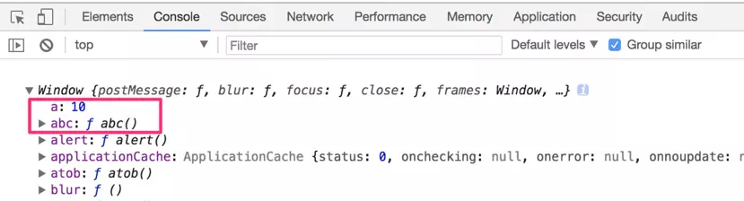

# call和apply的使用-基础篇

0.8022019.01.21 16:51:16字数 2140阅读 1853

就是想整理一篇关于call和apply的文档，不想编一些什么最近学习的时候遇到问题研究之后想分享给大家之类的理由，就是想写！就是想发！就是想！！！

以下是正文>>>>>>>>

在使用call和apply之前，我们需要先做一些知识储备：

## 一、window对象

window对象是js中的顶层对象，所有全局变量和全局函数都被绑定在了window对象身上，如何证明呢，我们可以先声明一个全局变量和函数，然后来观察window对象。如代码1-1：

```jsx
var a = 10;               //全局变量
function abc(){           //全局函数
    console.log("Young");
}
console.log(window);      //此时在window对象内已经出现了a属性和abc函数
```




image

那我们在定义了全局的变量a和全局的函数abc之后，为什么在使用他们时没有加上window对象的前缀呢，如代码1-2

```jsx
window.a;               //10
window.abc();           //Young
```

这是因为window对象作为一个全局对象，一般情况下在使用的时候是可以省略的，也就是不写，如代码1-3

```cpp
a;               //10
abc();           //Young
```

也是可以拿到a的值和执行abc函数。以上两种书写方式等价。

简单总结，window可以说是js中最大的boss，所有在明面上的人员和交易，都是属于window的，就算人员没有特别说明，每笔交易也没有单独的署名，但是window对象永远都是掌控一切。

## 二、this关键字，也就是所谓的执行上下文

说执行上下文可能有好多同学不明白，那么我们就说this这个关键字的含义。

this关键字存在于函数中，表示是一个指向，或者说是一个系统“变量”，值并不是固定的，但总是有迹可循。this的指向永远是一个对象，我们看代码2-1：

```jsx
var obj = {
    name: "Young",
    show: function (){
      console.log(this);
    }
}
obj.name;        //Young
obj.show();      //obj
```

从上面代码可以看出，this指向当前函数所在的obj对象，或者说this指向当前函数的调用对象，单只一个案例看不出规律，那么我们再来一个代码2-2:

```jsx
function fn(){
    console.log(this);
}
fn();     //window
```

此处执行函数fn之后，打印出fn内部的this为window对象，结合window知识点，可知此时的fn是一个全局函数，属于window对象，执行fn时，相当于执行了window.fn()，fn在window对象那且被window对象调用，所以fn内部的this指向了window。

再看代码2-3:

```jsx
var obox = document.getElementById("box");
obox.onclick= function (){
    console.log(this);
}
//单击obox这个div时，控制台打印出obox这个div标签
```

因为obox是一个元素对象，给obox元素添加点击事件，相当于给obox元素对象添加一个onclick属性，属性值为function，函数内部有一个this，当点击obox触发onclick，执行function时，打印出当前对象obox，依然符合this指向调用当前函数对象的原则。

综上所述，this的指向为：谁掉用当前this所在的函数，this就指向谁。也就是说，当前调用函数的那个对象自身就是this，就是当前的执行上下文。

## 三、执行上下文(this)的改变

执行上下文(this)是可以被改变的，为什么要改变执行上下文(this)呢，我们来模拟一种场景：

> 宿舍中，小A有每天洗头的习惯，每次洗完之后，头发湿漉漉的不方便，于是就攒钱买了一个吹风机，洗完之后吹一吹，神清气爽。小B洗头没有小A频繁，偶尔洗一次，洗完之后也是湿漉漉的不方便，但是又因为自己洗的次数少，所以不想再单独买一个吹风机，于是每次就借用小A的吹风机。
>
> 那么此时，我们如果把小A和小B都理解成一个对象，吹风机就是小A方法，它的所有人就是小A，小A在使用吹风机的时候，小A就是吹风就的执行上下文(this)。小B偶尔会需要用到吹风机，因为使用频次少，没必要重新买一个造成资源浪费，所以每次都是借用小A的，那么小B在使用吹风机的时候，吹风机被小B调用，此时小B就是吹风机的执行上下文(this)。此时吹风机的执行上下文(this)就被修改了。
>
> （此情景仅为模拟，不适用于现实生活，现实生活中不推荐小B的做法）

在代码中，当一个对象A具有一个方法fn，另一个对象B没有方法，但是需要用到同样功能的fn方法时，可以通过改变A对象中函数fn的执行上下文(this)来实现调用，达到节约代码空间，不产生冗余函数的目的。如代码3-1(字面量创建对象写法):

```jsx
var A = {
    name: "AAA",
    fn: function(skill){
    this.skill = skill;
      console.log("my name is " + this.name +", my skills are " + this.skill);
    }
}
var B = {
    name: "BBB"
}
A.fn("sing");          //my name is AAA, my skills are sing
B.fn("dance");         //Uncaught TypeError: B.fn is not a function;
```

代码3-2(构造函数创建对象写法):

```jsx
function ProA(name, skill){
    this.name = name;
    this.skill = skill;
    this.fn = function(){
      console.log("my name is " + this.name +", my skills are " + this.skill);
    }
}
function ProB(name, skill){   }

var A = new ProA("AAA","sing");
A.fn();             //AAA

var B = new ProB("BBB","dance");
B.fn();             //Uncaught TypeError: B.fn is not a function;
```

那么当我们确定好需求之后，接下来的操作就简单了，只要能找到一种方法，能够将对象A中函数fn的上下文修改成B对象，就可以解决这些问题。

此时，就可以使用call和apply这两个函数的方法，接下来我们只需要如何使用call和apply即可。

## 四、call和apply的使用

以上可得知call和apply这两个方法的功能是：用来修改函数的执行上下文(this)。

call和apply其实都是函数的方法，我们知道方法是对象中的函数，那么函数怎么还可以有函数呢，我们可以结合js中万物皆对象这句话，其实function在js中也是一个对象（可结合对象的原型来理解了，此处暂不做深究，了解原型请参考下篇文档），所以函数也有方法。

那么这两个方法如何使用呢，我们先来看完整语法：

**call(thisObj,arg1,arg2,arg3,……)**

call方法接收一个或一个以上的参数，当接收一个参数时，第一个参数表示要改变的原函数的执行上下文(this)；接收多个参数时，第二个参数及后面所有参数用来替换原函数的参数。

将代码3-1使用call方法改成如下代码4-1方式，即可让对象B具有对象A的fn方法，代码4-1：

```jsx
var A = {
    name: "AAA",
    fn: function(skill){
        this.skill = skill;
        console.log("my name is " + this.name +", my skills are " + this.skill);
    }
}
var B = {
    name: "BBB"
}
A.fn("sing");                 //my name is AAA, my skills are sing
//此处改动产生的效果为：
//在执行A对象的函数fn时，通过call将函数fn的执行上下文(this)暂时修改为对象B，
//此时fn中的this指向对象B，同时修改原函数fn的参数为“dance”，
//call方法自动执行改变之后的原函数
A.fn.call(B,"dance");         //my name is BBB, my skills are dance
```

将代码3-2使用call方法改成如下代码4-2方式，构造函数方式创建对象写法，代码4-2

```jsx
function ProA(name, skill){
    this.name = name;
    this.skill = skill;
    this.fn = function(){
        console.log("my name is " + this.name +", my skills are " + this.skill);
    }
}
function ProB(name, skill){
    //此处改动产生的效果为：
    //在ProB内，通过apply，执行，并改动ProA中的执行上下文(this)，
    //及修改ProA的参数为ProB所接收的参数
    //那么在new调用ProB时，相当于调用了被修改了执行上下文和参数之后的ProA
    ProA.call(this, name, skill)
}
var A = new ProA("AAA","sing");
A.fn();          //my name is AAA, my skills are sing
var B = new ProB("BBB","dance");
B.fn();          //my name is BBB, my skills are dance
```

**apply(thisObj,argArr)**

apply方法接受一个或两个参数，当接收一个参数时，第一个参数表示要改变的原函数的执行上下文(this)；接收两个参数时，第二个参数必须是数组(或伪数组)，用于替换原函数中arguments保存的参数，

将代码3-1使用apply方法改成如下代码4-3方式，即可让对象B具有对象A的fn方法，代码4-3：

```jsx
var A = {
    name: "AAA",
    fn: function(skill){
    this.skill = skill;
        console.log("my name is " + this.name +", my skills are " + this.skill);
    }
}
var B = {
    name: "BBB"
}
A.fn("sing");                  //my name is AAA, my skills are sing
//此处改动产生的效果为：
//在执行A对象的函数fn时，通过apply将函数fn的执行上下文(this)暂时修改为对象B，
//此时fn中的this指向对象B，同时修改原函数fn的参数为“dance”(注意“dance”参数必须是数组的形式)，
//apply方法自动执行改变之后的原函数
A.fn.apply(B,["dance"]);       //my name is BBB, my skills are dance
```

将代码3-2使用call方法改成如下代码4-2方式，构造函数方式创建对象写法

```jsx
function ProA(name, skill){
    this.name = name;
    this.skill = skill;
    this.fn = function(){
        console.log("my name is " + this.name +", my skills are " + this.skill);
    }
}
function ProB(name, skill){
    //此处改动产生的效果为：
    //在ProB内，通过apply，执行，并改动ProA中的执行上下文(this)，
    //及修改ProA的参数为ProB所接收的参数(注意：此时的参数必须是一个数组的格式)
    //那么在new调用ProB时，相当于调用了被修改了执行上下文和参数之后的ProA
    ProA.apply(this, [name, skill])
    //参数也可以写成arguments的形式，arguments属于伪数组，但是也可以被apply所接收处理，如：
    //ProA.apply(this, arguments)
}
var A = new ProA("AAA","sing");
A.fn();        //my name is AAA, my skills are sing
var B = new ProB("BBB","dance");
B.fn();        //my name is BBB, my skills are dance
```

以上就是call和apply的使用，在我们明确需求的情况下，只需要掌握call或apply固定语法，就可以自由的转换某个对象中函数的执行上下文(this)了。

同时，在OOP中，通过call和apply改变执行上下文(this)，实现使原本没有某个方法的对象，具有这个方法，的这个过程也叫继承。


# call和apply的使用-扩展篇

0.1362019.01.17 17:02:13字数 942阅读 4143

## 一、回顾

在上篇文章[call和apply的使用-基础篇](https://www.jianshu.com/p/0a6655dbf420)中，我们已经提到了call和apply的功能和语法，这里稍作回顾：

**介绍：**call和apply都是函数的方法，需要加在函数体后执行。

**功能：**都是用来修改函数的执行上下文(this)。

**语法：**

- call(thisObj,arg1,arg2,arg3,……)
- apply(thisObj,argArr)
  说明：call和apply的主要区别就是：call可以接受一个或以上的参数，当接受多个参数时，从第二个参数开始，后面所有的参数都会改变原函数的参数；apply只能接受一个或两个参数，当接受两个参数时，第二个参数必须是一个数组或类数组，数组中的数据，会改变原函数arguments中的参数。
  而call和apply的第一个参数，都是用来改变原函数的this指向。

**所以，以下演示以call为主，如果只有一个参数，那么可以直接替换成apply，并无区别；如果存在两个以上参数，替换成apply时，需要把第二个及后面所有参数放在一个数组中。**

## 二、使用

#### 使用方式1：执行时一个对象可以使用另一个对象的方法

```jsx
    function Doctor(){
        this.name = "Doctor";
        this.say = function(){
            console.log(this.name);
        }
    }
    function Stephen(){
        this.name = "Stephen Strange";
    }
    var doctor = new Doctor();
    var stephen = new Stephen();
    // 通过call将stephen对象传入doctor的say方法，此时say方法中的this被指向stephen对象
    doctor.say.call(stephen);       //Stephen Strange
```

#### 使用方式2：实现继承

```jsx
    function Doctor(name){
        this.name = name;
        this.say = function(){
            console.log(this.name)
        }
    }
    function Stephen(name){
        //当前函数内的this指向函数Son的实例化对象
        //在执行Stephen时执行Doctor，同时将Doctor内的this改变成Stephen的this
        Doctor.call(this,name)
    }

    var doctor = new Doctor("Doctor")
    doctor.say();       //Doctor
    var stephen = new Stephen("Stephen Strange")
    // 在Stephen中并没有say方法，但是因为在new Stephen时，执行了Doctor，
    // 并将Doctor中的this指向Stephen的this，
    // 那么在new Stephen后，得到的实例，也具有了Doctor内的属性和方法
    stephen.say();      //Stephen Strange
```

#### 使用方式3：多继承

```jsx
    function People(){
        this.say = function(){
            console.log(`My name is ${this.name}. I will have ${this.attr} ${this.skill}.`)
        }
    }
    function Doctor(){
        this.skill = "cure";
    }
    function Magic(){
        this.attr = "Amazing";
    }
    function Stephen(name){
        this.name = name;
        // 执行其他函数的同时将原函数的this指向都改成Stephen的this，此时所有属性和方法可以互相访问
        People.call(this);
        Doctor.call(this);
        Magic.call(this);
    }
    var stephen = new Stephen("Stephen Strange");
    stephen.say();      //My name is Stephen Strange. I will have Amazing cure.
```

#### 使用方式4：改变系统函数的this指向，实现伪数组转真数组

我们知道js中有很多类（伪）数组，伪数组虽然也按照索引存储数据，有length属性，但是却不具有数组的方法，如push，pop等。
如果我们想使用数组的方法来操作伪数组，那么需要先将伪数组转成真数组，伪转真的方法有很多种，这里我们只说使用call方法转换：

```jsx
    var ali = document.querySelectorAll("li");
    // instanceof:查看一个实例是否指向某个构造函数的原型（查看一个实例是否属于某个类）
    console.log(ali instanceof Array);      //false
    // ali.push("hello");         //报错：ali.push is not a function
    
    var arr = new Array(4,5,6);
    // instanceof:查看一个实例是否指向某个构造函数的原型（查看一个实例是否属于某个类）
    console.log(arr instanceof Array);      //true
    arr.push("hello")
    console.log(arr);         //[4,5,6,"hello"]

    //此处开始转换
    var aliZ = Array.prototype.slice.call(ali)
    console.log(aliZ)
    console.log(aliZ instanceof Array);     //true
    // 此时aliZ就是一个真数组，可以使用数组的众多方法来操作
    aliZ.push("world");
    console.log(aliZ);       //[li,li,li,...,"world"]
```

#### 使用方式5：优化Math对象的方法

Math对象的min和max方法只能接受多个数据，而不能接受单个数组。但是我们知道，函数内的arguments保存所有传进来的实参，此处利用apply第二个参数是数组，并且会覆盖原函数arguments的特点，将数组由apply传进去，交给min或max处理，即可快速得到数组的最大或最小值

```jsx
    var arr = [4,6,2,7,1];
    console.log(Math.min(arr));             //NaN
    console.log(Math.max(arr));             //NaN

    console.log(Math.min.apply(null,arr))   //1
    console.log(Math.max.apply(null,arr))   //7
```

#### 使用方式6：改造系统方法的调用方式

我们知道js中许多实例的方法都是定义在构造函数的原型对象上，如Array.prototype.push / String.prototype.match / Function.prototype.bind等，当我们通过实例调用这些方法时，调用方式为arr.push() / str.match() / fn.bind()，我们可以利用call或apply函数改变这些实例方法的调用方式。
改造之后的调用如：push(arr,"hello")

```tsx
    let arr = [3,4,5];
    Array.prototype.push.call(arr,"hello")
    console.log(arr);                       //[3,4,5,"hello"]

    // 通过执行Function原型上的call方法的bind方法，改变call中原本应指向Function实例的this为Array.prototype.push，
    // 并保存bind的返回值--改造之后的新call函数，放在newPush
    const newPush = Function.prototype.call.bind(Array.prototype.push);
    // 此时，call方法中的this指向为Array原型上的push方法，
    // 执行newPush，相当于执行了Function.prototype.call.call(Array.prototype.push)，
    // call的第一个参数用来改变原函数this的指向，后call将前call中的this改成Array.prototype.push
    // 此时后call执行，得到改变之后的前call
    // 也就相当于得到了Array.prototype.push.call()
    // 最终执行newPush相当于执行了Array.prototype.push.call()
    newPush(arr,"world");
    console.log(arr);                       //[3,4,5,"hello","world"]

    // 此类改造还有：
    const slice   = Function.prototype.call.bind(Array.prototype.slice);
    console.log(slice(arr, 0, 2));          //[3,4]
    const match = Function.prototype.call.bind(String.prototype.match);
    console.log(match("a1ab12abc123", /\d+/g));     //["1", "12", "123"]

    // 练习：使用相同方式尝试改造数组或字符的其他方法
```

## 三、总结

其实不管在任何地方，只要牢记call和apply方法的功能：修改原函数的this指向，并执行这个新函数。就可以轻松的驾驭函数的call和apply方法。

临近结尾顺便提一下函数的另一个方法bind，其实bing和call/apply的功能类似，只不过bind修改this指向之后，返回的新函数不会自动执行，如果有需要，需要手动执行；而call和apply改变this之后，返回的新函数会自动执行。