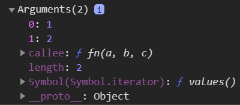
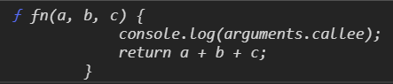
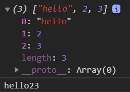

## JavaScript 函数中的 arguments 对象

## 一、arguments 概念

```javascript
在JavaScript中，参数在函数内部是以一个数组表示的，函数接受的永远是一个数组
arguments是函数内部的一个专门用来存储实参的数组对象
```

## 二、arguments 特点

```javascript
1.arguments对象和Function是分不开的
2.arguments对象不能显式创建
3.arguments对象只有函数开始时才可用
```

## 三、arguments 方法

```javascript
arguments.callee; //自己，arguments所在的函数，指向当前执行的函数。
arguments.caller; //指向调用当前函数的函数
arguments.length; //获得长度，实参的个数
arguments[i]; //通过遍历索引，获得每个实参
```

### 1.arguments 对象

```javascript
function fn(a, b, c) {
  console.log(arguments); //输出内容见下图
  return a + b + c;
}
console.log(fn(1, 2, 3)); //输出6
```



### 2.arguments.callee

```javascript
function fn(a, b, c) {
  console.log(arguments.callee); //输出当前函数本身，见下图
  return a + b + c;
}
console.log(fn(1, 2, 3)); //输出6
```



### 3.arguments.length

```javascript
function fn(a, b, c) {
  console.log(arguments.length); //输出3---当前arguments的长度
  return a + b + c;
}
console.log(fn(1, 2, 3)); //输出6
```

### 4.arguments[]

#### 1）输出参数

```javascript
function fn(a, b, c) {
  for (var i = 0; i < arguments.length; i++) {
    console.log(arguments[i]); //依次输出1,2,3
  }
  return a + b + c;
}
console.log(fn(1, 2, 3)); //输出6
```

#### 2）设置参数

```javascript
function fn(a, b, c) {
  arguments[0] = "hello"; //参数也可被设置
  for (var i = 0; i < arguments.length; i++) {
    console.log(arguments[i]); //依次输出  hello,2,3
  }
  return a + b + c;
}
console.log(fn(1, 2, 3)); //输出hello23---三个值通过+号转为字符串进行连接
```

### 5.arguments 注意事项

```javascript
//在函数中只要是实参全都传给arguments
//在函数中，形参和实参的个数，可以为任意个，甚至数量不对应，程序都不会报错，但是在计算过程中可能会出现NaN
function fn(a, b, c) {
  return a + b + c;
}
console.log(fn(1, 2)); //输出NaN---因为形参c没有接收到数据，但在进行运算时用到了形参c
```

## 四、arguments 转数组

**arguments**对象不是一个真正的数组 ，它类似于数组，但除了 length 属性和索引元素之外没有任何数组属性。

例如，它没有 [pop](https://developer.mozilla.org/zh-CN/docs/Web/JavaScript/Reference/Global_Objects/Array/pop) 方法。

但是它可以被转换为一个真正的**数组**，转换为真实的数组后就可以使用完整的**数组方法**

```javascript
function fn(a, b, c) {
  arguments[0] = "hello"; //参数也可被设置
  var args = Array.from(arguments); //进行转数组操作
  console.log(args); //结果见下图，输出的是一个数组
  return a + b + c;
}
console.log(fn(1, 2, 3)); //输出hello23---通过+号字符串拼接
```


